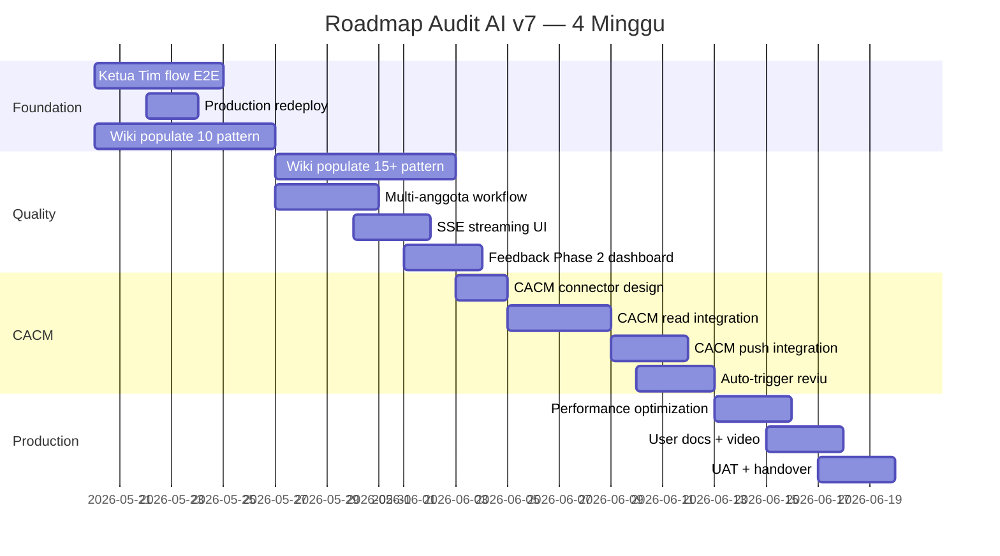
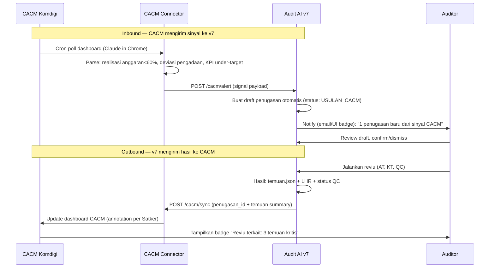

# Desain Proyek Audit AI v7 — Roadmap 1 Bulan

**Periode:** 20 Mei – 19 Juni 2026  
**Owner:** Inspektorat II Komdigi  
**Status dokumen:** Living document — di-update tiap akhir minggu  
**Lihat juga:** [README.md](README.md) (setup), [DEPLOY.md](DEPLOY.md) (deploy)

---

## 1. Ringkasan Eksekutif

Audit AI v7 saat ini sudah memiliki pipeline end-to-end yang berfungsi di dev lokal untuk **Reviu Pengadaan** dengan 4 agen Claude (Ingestion, Anggota Tim, QC SAIPI, Ketua Tim). Roadmap 4 minggu ini menyelesaikan **3 hal besar**:

1. **Closure pipeline** — Ketua Tim flow end-to-end + production deploy yang benar
2. **Wiki populate** — knowledge base 25+ pattern temuan agar agen konsisten dengan gaya tim
3. **CACM integration** — sistem audit AI menerima sinyal dari Continuous Auditing & Continuous Monitoring Komdigi untuk proaktif jadwalkan reviu

Hasil akhir: sistem siap dipakai produksi untuk 2 skill (Reviu RKA-K/L + Reviu Pengadaan) dengan loop perbaikan iteratif lewat feedback agen + auditor.

---

## 2. Kondisi Saat Ini (20 Mei 2026)

### Apa yang sudah jalan

| Area | Status | Catatan |
|------|--------|---------|
| Dev environment lokal | ✅ Stable | Setup gotcha didokumentasikan di README |
| 4 agen Claude hardened | ✅ Stable | tools=[], strict prompt, MCP-only access |
| Pipeline V6 reviu-pengadaan | ✅ Jalan E2E | 39 tool calls per run, QC PASS |
| Pipeline V6 reviu-rka-kl | ✅ Jalan E2E | Via bridge staging (`_stage_rka_inputs`); 4/4 RO sukses, 25 anomali, LHR ter-render dengan dummy-test-docs RKA |
| File output access (UI) | ✅ Stable | Tab Output & QC dengan download + preview |
| Auto-ingestion on upload | ✅ Stable | BackgroundTask di POST `/dokumen` |
| Wiki pattern library | ✅ Infrastruktur siap | Hanya 2 pattern contoh (RP-08, RKA-01) |
| Feedback loop Phase 1 | ✅ Stable | File JSON per run, visible di Output tab |
| Backend deploy Fly.io | ⚠️ Deployed tapi AI belum jalan | Dockerfile baru perlu push |
| Frontend deploy Vercel | ✅ Stable | URL: audit-ai-v7.vercel.app |

### Yang masih kosong / blocker

1. **Alur Ketua Tim belum ada** — sasaran-assignment.json + context.md tujuan/tim masih harus diisi manual oleh auditor
2. **Production AI tidak jalan** — image Fly.io belum di-rebuild dengan Dockerfile + dependency baru (Node.js + claude-code CLI + claude-agent-sdk 0.1.81 + pydantic 2.11.10)
3. **CACM integration belum ada** — Komdigi sudah punya sistem CACM (Continuous Auditing & Continuous Monitoring), tapi v7 belum bisa konsumsi/push data ke sana
4. **Wiki kosong** — hanya 2 contoh pattern, butuh 25+ untuk realistis menutup skill yang ada

---

## 3. Tujuan 1 Bulan

| Tujuan | Indikator Sukses |
|--------|------------------|
| **T1.** Pipeline reviu lengkap (AT + KT) jalan tanpa intervensi manual | Auditor cukup buat penugasan, upload dokumen, lalu klik "Jalankan Pipeline Otomatis" → output siap KKP + LHR + laporan QC |
| **T2.** Wiki menjadi rujukan riil tim | 25+ pattern temuan terisi, 80% temuan agen mengacu ke pattern wiki |
| **T3.** CACM sync 2 arah | (a) v7 baca alert CACM → proaktif buat penugasan; (b) hasil reviu v7 di-push balik ke CACM sebagai annotation |
| **T4.** Production ready | 1 reviu real end-to-end di Fly.io + Vercel tanpa fallback ke lokal. Time-to-result < 10 menit per penugasan |
| **T5.** Loop perbaikan jalan | Feedback agen di-review mingguan, minimal 3 pattern baru dari pattern_suggestions |

---

## 4. Roadmap Week-by-Week



### Minggu 1 (20–26 Mei): Foundation Completion

**Tema:** Tutup gap Tier 1 yang tersisa. Siapkan production yang stabil.

#### Deliverables

| ID | Item | Owner | Estimasi |
|----|------|-------|----------|
| W1.1 | Agen Ketua Tim ekstrak sasaran dari ST/PKP + UI tab "Setup Penugasan" | Dev | 3 hari |
| W1.2 | Multi-step KT flow: assign sasaran → konfirmasi auditor → write sasaran-assignment.json | Dev | 1 hari |
| W1.3 | Redeploy backend ke Fly.io dengan Dockerfile + deps baru, verify AI jalan | DevOps | 1 hari |
| W1.4 | Wiki populate: 5 pattern reviu-pengadaan + 5 pattern reviu-rka-kl | Auditor + Dev | 4 hari (paralel) |
| W1.5 | Test E2E reviu-rka-kl dengan dokumen nyata (1 penugasan DIT. Pengendalian) | Auditor + Dev | 1 hari |

#### Acceptance criteria

- KT bisa login, pilih penugasan, klik "Setup Sasaran" → agen baca ST/PKP dari `_INGESTED/`, ekstrak draft sasaran → KT review → confirm → `sasaran-assignment.json` ter-tulis
- Production URL `audit-ai-v7.fly.dev/health` return ok; `claude --version` di container working
- 10 file pattern di-merge ke `wiki/temuan-patterns/{skill}/`, README per skill di-update
- Reviu RKA-K/L 1 penugasan selesai E2E tanpa improvisasi agen

---

### Minggu 2 (27 Mei – 2 Juni): Quality & Scale

**Tema:** Tingkatkan kualitas output + UX. Persiapkan untuk multi-user.

#### Deliverables

| ID | Item | Owner | Estimasi |
|----|------|-------|----------|
| W2.1 | Wiki populate: 8 pattern reviu-pengadaan + 7 pattern reviu-rka-kl (total ≥25) | Auditor | 5 hari |
| W2.2 | Multi-anggota tim workflow: 1 penugasan punya 2+ anggota, masing-masing isi KKP terpisah | Dev | 3 hari |
| W2.3 | SSE streaming UI: ganti `runAgent` sync dengan EventSource → text/tool_use real-time di chat | Dev | 3 hari |
| W2.4 | Dashboard feedback aggregate: route `/feedback` yang scan semua `_FEEDBACK-AGEN/*.json` cross-penugasan, tampilkan top issues + pattern suggestions | Dev | 3 hari |
| W2.5 | Hydration warning fix di frontend dashboard | Dev | 0.5 hari |
| W2.6 | Persist agent run history per penugasan (sudah ter-store di DB, perlu UI "Riwayat") | Dev | 1 hari |

#### Acceptance criteria

- Wiki total 27+ pattern, masing-masing skill ≥12
- Skenario "2 anggota tim, 4 sasaran" jalan: masing-masing AT isi 2 sasaran, KT combine + render LHR
- Chat AT tampilkan tool calls + text token-by-token saat agen jalan (tidak nunggu sampai selesai)
- `/feedback` dashboard tampilkan: total feedback 30 hari terakhir, top 5 workflow issues, top 5 pattern suggestions, severity heatmap

---

### Minggu 3 (3 – 9 Juni): CACM Integration

**Tema:** Connect v7 ke sistem Continuous Auditing & Continuous Monitoring (CACM) yang sudah ada di Komdigi.

#### Design CACM Integration



#### Deliverables

| ID | Item | Owner | Estimasi |
|----|------|-------|----------|
| W3.1 | Design dokumen CACM integration (payload schema, auth, frekuensi sync, error handling) | Dev + Auditor | 2 hari |
| W3.2 | CACM read connector — module Python yang query CACM via Claude in Chrome (pakai logic dari skill ews-cacm-komdigi) → return signal terstruktur | Dev | 3 hari |
| W3.3 | Backend endpoint `POST /cacm/alert` — terima signal CACM, buat draft Penugasan dengan status `USULAN_CACM` | Dev | 1 hari |
| W3.4 | Frontend: badge "Usulan dari CACM" di list penugasan + tab review/dismiss | Dev | 2 hari |
| W3.5 | CACM push: endpoint `POST /cacm/sync` yang kirim hasil reviu balik ke CACM annotation | Dev | 2 hari |
| W3.6 | Scheduled task: tiap pagi 06:00 poll CACM → check alert baru → auto-create penugasan | Dev | 1 hari |
| W3.7 | Auditor training session: cara handle penugasan dari CACM vs penugasan manual | Auditor | 0.5 hari |

#### Acceptance criteria

- Skenario "CACM tampilkan realisasi anggaran Satker X < 60% di Q1" → v7 otomatis buat penugasan "Reviu Kinerja Realisasi Anggaran Satker X" → muncul di UI dengan badge
- Auditor accept usulan → run pipeline → hasil reviu di-push balik ke CACM, terlihat di dashboard CACM sebagai annotation per Satker
- Tidak ada signal CACM yang hilang dalam 7 hari berturut-turut

#### Trade-off & Risiko CACM

- **CACM tidak punya API resmi** → terpaksa scrape via Claude in Chrome. Fragile bila layout CACM berubah. Mitigasi: monitoring + alert kalau scrape error 2x berturut-turut
- **Auth** → user perlu login manual di Chrome sebelum scheduled task. Mitigasi: dokumentasi tetap login, monitor cookie expiry
- **Rate limit** → polling tiap pagi cukup, tidak realtime. CACM bukan high-frequency event source

---

### Minggu 4 (10 – 19 Juni): Production Hardening & Handover

**Tema:** Performansi, dokumentasi, transfer pengetahuan ke tim.

#### Deliverables

| ID | Item | Owner | Estimasi |
|----|------|-------|----------|
| W4.1 | Performance optimization: caching `list_temuan_patterns` per request, parallel `read_pdf_page` per anomali, debounce ingestion task | Dev | 3 hari |
| W4.2 | Backup/restore SOP: pg_dump scheduler Fly + restore script + test recovery | Dev/Ops | 1 hari |
| W4.3 | Monitoring: setup budget alert Anthropic (USD 5/hari) + Fly (USD 10/bln) | Ops | 0.5 hari |
| W4.4 | User documentation: panduan auditor (PDF + video screen-record 15 mnt) | Auditor + Dev | 3 hari |
| W4.5 | Wiki best-practices: 1-hari workshop dengan tim reviu, finalize struktur folder + tagging | Auditor | 1 hari |
| W4.6 | UAT — 3 penugasan real (1 reviu-pengadaan, 1 reviu-rka-kl, 1 dari CACM auto) | Auditor + Dev | 2 hari |
| W4.7 | Handover meeting + final ROADMAP retrospective | Semua | 0.5 hari |

#### Acceptance criteria

- Time-to-result < 10 menit per penugasan (dari klik "Jalankan" sampai laporan ready)
- Backup Postgres harian, restore time < 30 menit
- Dokumentasi auditor + video tersedia di internal portal
- 3 penugasan UAT lulus tanpa intervensi developer

---

## 5. Wiki Development Plan

### Status saat ini

- 2 pattern contoh: RP-08 (reviu-pengadaan), RKA-01 (reviu-rka-kl)
- Infrastruktur: `list_temuan_patterns` + `get_temuan_pattern` MCP tool sudah jalan

### Target akhir bulan: 25+ pattern

#### Reviu Pengadaan (target 13 pattern)

| ID | Judul (rencana) | Kategori | Severity | Status |
|----|------|----------|----------|--------|
| RP-01 | KAK Tidak Memuat SLA Terukur | PBJ-KAK | HIGH | ⏳ Week 1 |
| RP-02 | KAK Mencantumkan Beberapa Metode Pemilihan | PBJ-METODE | MEDIUM | ⏳ Week 1 |
| RP-03 | Spesifikasi Teknis KAK Mengarah ke Satu Brand | PBJ-KAK | HIGH | ⏳ Week 1 |
| RP-04 | KAK Tidak Memuat Jadwal Pelaksanaan Terinci | PBJ-KAK | MEDIUM | ⏳ Week 2 |
| RP-05 | HPS Tidak Mencantumkan Dasar Perpres 12/2021 | PBJ-HPS | MEDIUM | ⏳ Week 1 |
| RP-06 | HPS Merujuk SBM TA Sebelumnya | PBJ-HPS | MEDIUM | ⏳ Week 1 |
| RP-07 | HPS Inkonsisten dengan Spesifikasi KAK | PBJ-TRACEABILITY | HIGH | ⏳ Week 2 |
| RP-08 | HPS Tidak Didukung Minimum 2 Sumber Harga | PBJ-HPS | CRITICAL | ✅ Done |
| RP-09 | RFI Lewat Masa Berlaku Penawaran | PBJ-RFI | MEDIUM | ⏳ Week 2 |
| RP-10 | RFI dari Vendor Anak Perusahaan Sama | PBJ-RFI | HIGH | ⏳ Week 2 |
| RP-11 | Kontrak Tidak Memuat Pasal Denda SLA | PBJ-KONTRAK | HIGH | ⏳ Week 2 |
| RP-12 | Nilai Kontrak > 80% HPS Tanpa Justifikasi | PBJ-KONTRAK | MEDIUM | ⏳ Week 2 |
| RP-13 | Jangka Waktu Kontrak Inkonsisten KAK ↔ Kontrak | PBJ-TRACEABILITY | MEDIUM | ⏳ Week 2 |

#### Reviu RKA-K/L (target 13 pattern)

| ID | Judul (rencana) | Kategori | Severity | Status |
|----|------|----------|----------|--------|
| RKA-01 | TOR Tidak Memuat 7 Blok Substansi | RKA-TOR | HIGH | ✅ Done |
| RKA-02 | Indikator Kinerja TOR Tidak Terukur | RKA-TOR | HIGH | ⏳ Week 1 |
| RKA-03 | RAB Tidak Konsisten dengan TOR | RKA-CASCADING | HIGH | ⏳ Week 1 |
| RKA-04 | Akun Belanja RAB Tidak Sesuai BAS | RKA-RAB | MEDIUM | ⏳ Week 1 |
| RKA-05 | SBM Lewat Tahun Anggaran | RKA-SBM | MEDIUM | ⏳ Week 1 |
| RKA-06 | Honorarium di Atas Plafon SBM | RKA-SBM | HIGH | ⏳ Week 2 |
| RKA-07 | Belanja Perjalanan Dinas Tidak Wajar | RKA-RAB | MEDIUM | ⏳ Week 2 |
| RKA-08 | Cascading Output ke Komponen Tidak Konsisten | RKA-CASCADING | HIGH | ⏳ Week 2 |
| RKA-09 | Penandaan Output Tidak Sesuai Renstra | RKA-PENANDAAN | LOW | ⏳ Week 2 |
| RKA-10 | KPI Tidak Selaras dengan RO | RKA-KPI | HIGH | ⏳ Week 2 |
| RKA-11 | Anggaran Konsultan Tanpa TOR Terlampir | RKA-RAB | MEDIUM | ⏳ Week 2 |
| RKA-12 | RAB Sosialisasi/FGD Tanpa Output Konkret | RKA-RAB | LOW | ⏳ Week 2 |
| RKA-13 | Anggaran Operasional Lebih dari 30% Total | RKA-RAB | MEDIUM | ⏳ Week 2 |

### Workflow populate pattern

1. **Identifikasi** — auditor seniors tarik temuan top dari LHR historis 2024–2025
2. **Drafting** — auditor tulis pattern di template `.md` dengan YAML frontmatter
3. **Review** — Pengendali Teknis review pattern (severity, kriteria_baku akurat)
4. **Commit** — push ke `wiki/temuan-patterns/{skill}/` + update tabel index di README per skill
5. **Validation** — run agen di penugasan sample → cek apakah pattern terpanggil + di-pakai

### Catatan kualitas pattern

- **Severity calibration:** CRITICAL hanya untuk pelanggaran peraturan inti (Perpres, PMK, UU). HIGH untuk kepatuhan substantif. MEDIUM/LOW untuk best-practice
- **Kriteria_baku WAJIB sebut pasal/ayat** — tidak boleh "berdasarkan peraturan yang berlaku"
- **Bukti yang harus dicari** — tabel dokumen + field, agar agen bisa target verifikasi PDF tepat
- **Rekomendasi standar opsional** — kalau ada, KT bisa langsung pakai

---

## 6. CACM Integration Design Detail

### Asumsi

- **CACM** = sistem internal Komdigi (yang sudah ada) untuk Continuous Auditing & Continuous Monitoring per Satker
- Akses via web browser dashboard (tidak ada REST API resmi)
- Sudah ada skill `ews-cacm-komdigi` yang melakukan polling EWS dengan Claude in Chrome — kita pakai pattern yang sama

### Komponen baru di v7

#### 6.1. CACM Connector Module

**Lokasi:** `backend/app/integrations/cacm/`

```
cacm/
├── __init__.py
├── client.py         # Claude in Chrome wrapper (login, navigate, scrape)
├── parser.py         # parse halaman CACM → struktur signal
├── models.py         # CacmSignal pydantic model
└── scheduler.py      # cron job pull CACM tiap pagi
```

**CacmSignal schema:**
```python
class CacmSignal(BaseModel):
    signal_id: str               # unique per polling cycle
    satker: str                  # e.g. "DIT. PENGENDALIAN APLIKASI"
    kategori: Literal["ANGGARAN", "PENGADAAN", "KINERJA", "PRIORITAS"]
    severity: Literal["MERAH", "KUNING", "HIJAU"]
    metric: str                  # e.g. "realisasi_q1_persen"
    value: float                 # e.g. 58.2
    threshold: float             # e.g. 75.0
    deskripsi: str               # narasi ringkas dari CACM
    cacm_url: HttpUrl            # link ke halaman detail di CACM
    captured_at: datetime
```

#### 6.2. Inbound: Penugasan auto-create dari signal CACM

**Endpoint baru:** `POST /cacm/alert` (internal, dipanggil scheduler)

Logic:
1. Receive `CacmSignal[]`
2. Filter signal severity MERAH/KUNING saja
3. Untuk tiap signal:
   - Cek apakah sudah ada penugasan aktif untuk Satker + kategori serupa (anti-duplicate)
   - Bila belum: buat `Penugasan` baru dengan `status=USULAN_CACM`, isi `context.md` dengan signal data, attach CACM URL sebagai dokumen referensi
   - Tag penugasan dengan `signal_id` di field metadata

**UI:**
- List penugasan tab "Usulan CACM" (badge merah) untuk auditor PM/PT
- Klik penugasan → halaman review dengan signal detail + tombol "Terima sebagai penugasan" / "Tolak"
- Bila terima: status berubah `DRAFT`, masuk pipeline normal

#### 6.3. Outbound: Push hasil reviu ke CACM annotation

**Endpoint baru:** `POST /cacm/sync` (dipanggil setelah QC PASS)

Logic:
1. Setelah `run_qc_kkp` / `run_qc_lhp` return PASS, trigger sync
2. Format payload:
   ```json
   {
     "satker": "DIT. PENGENDALIAN APLIKASI",
     "penugasan_kode": "2026-05-reviurka-...",
     "tanggal_lhr": "2026-06-15",
     "ringkasan": "5 temuan (1 CRITICAL, 2 HIGH, 2 MEDIUM)",
     "url_lhr": "https://audit-ai-v7.vercel.app/penugasan/123",
     "lampiran_lhr_url": "..."
   }
   ```
3. Push via Claude in Chrome ke CACM annotation field per Satker

**Catatan:** Karena tidak ada API, mekanisme ini paste teks ke text field di CACM dashboard, ATAU export PDF dan upload sebagai attachment. Detail teknis di Week 3.

#### 6.4. Auth & Operations

| Aspek | Pendekatan |
|-------|------------|
| Login CACM | Auditor login manual di Chrome 1x, cookie disimpan di profile khusus untuk scheduled task |
| Frekuensi polling | Tiap pagi 06:00 WIB (sebelum jam kerja) — cukup untuk daily signals |
| Retry policy | 3x retry dengan exponential backoff, lalu fail-loud (notifikasi ke auditor) |
| Monitoring | Log per cycle: jumlah signals di-fetch, jumlah jadi penugasan, jumlah duplicate. Dashboard `/cacm/health` |
| Failure mode | Bila scrape gagal 2 hari berturut-turut, kirim email alert ke PM |

#### 6.5. Risk mitigation

- **Layout CACM berubah** → konfigurasikan selector di JSON, tidak hardcode di Python. Auditor bisa update tanpa redeploy
- **Cookie expired** → cek di awal setiap cycle; bila gagal login, lapor segera
- **Signal palsu / false positive CACM** → auditor manual filter via UI "Tolak" — bukan v7 yang validate, biar reproducible

---

## 7. Risiko & Mitigasi

| # | Risiko | Likelihood | Dampak | Mitigasi |
|---|--------|-----------|--------|----------|
| R1 | Anthropic API rate limit di production | Medium | High | Set budget alert + queue mechanism + caching context |
| R2 | CACM scraping rusak karena layout berubah | High | Medium | Selector config eksternal, monitoring + alert |
| R3 | Wiki tidak terisi sesuai target karena auditor sibuk | High | High | Workshop wajib minggu 1 + 2 (4 jam total). PT/PM accountable |
| R4 | Multi-anggota workflow blocked oleh model permissions | Low | Medium | Test early di Week 2, fallback ke 1-anggota mode kalau perlu |
| R5 | Production deploy gagal saat redeploy karena pydantic upgrade | Low | High | Test pip install di local venv dulu sebelum push ke Fly |
| R6 | User adoption rendah | Medium | High | UAT real penugasan + dokumentasi video + training session |
| R7 | Data sensitive bocor (temuan tampil di CACM yang lebih luas) | Low | CRITICAL | Audit logging, ACL per Satker, review SOP sebelum prod |

---

## 8. Success Criteria (Definition of Done)

Roadmap dikatakan berhasil bila per 19 Juni 2026:

### Quantitative

- ✅ ≥25 pattern terisi di wiki
- ✅ ≥3 penugasan UAT lulus E2E (1 RKA, 1 PBJ manual, 1 PBJ dari CACM)
- ✅ Time-to-result < 10 menit per penugasan
- ✅ Production uptime ≥ 99% selama Week 4
- ✅ 0 edit ke V6 oleh agen (verified via git diff backend/v6/)
- ✅ Feedback agen menghasilkan ≥3 pattern baru yang merged ke wiki

### Qualitative

- ✅ Auditor merasa output AI agen reliable enough untuk dipakai sebagai draft KKP/LHR
- ✅ KT bisa setup penugasan baru dari nol via UI tanpa edit JSON manual
- ✅ Penugasan dari CACM signal terbukti relevan (≥70% accept rate dari auditor)

---

## 9. Tim & Tanggung Jawab

| Role | Tanggung Jawab | Allocation |
|------|----------------|------------|
| Inspektur II (PM) | Approve roadmap, review milestone mingguan, accountable terhadap delivery | 1 hari/minggu |
| Pengendali Teknis (PT) | Review pattern wiki, technical decision (mis. terima/tolak signal CACM), validasi UAT | 2 hari/minggu |
| Ketua Tim Audit | Workshop wiki, populate pattern, test KT flow, jadi auditor di UAT | 3 hari/minggu |
| Anggota Tim Audit (2 orang) | Test E2E pipeline, isi pattern reviu-rka-kl, jadi auditor di UAT | 2 hari/minggu each |
| Developer (Irfan) | Implementasi semua deliverable W1-W4, deploy, monitoring | 5 hari/minggu |

---

## 10. Deliverables Checklist

### Minggu 1
- [x] **W1.1 — sasaran setup** ✅ pivoted & closed. Versi asli ("agen baca KP/PKP PDF + ekstrak sasaran") dibatalkan karena PKP/KP tak lagi diupload — diganti: (a) UI tab "Setup Penugasan" untuk KT (sudah ada — editable form sasaran + context.md), (b) Chat KT Mode A bantu draft via percakapan (sudah ada), (c) **stub SIMWAS** baru — `POST /penugasan/{id}/sasaran/sync-from-simwas` + button "Impor dari SIMWAS" di Setup tab (paste payload PKP, strategy replace/append, anti-tabrakan ID, source='manual' aktif hari ini + source='api' placeholder 501 sampai kontrak SIMWAS resmi). Saat API SIMWAS hidup, frontend tinggal fetch SIMWAS lalu kirim ke endpoint ini. Lihat `app/routes/penugasan.py` + `app/fixtures/simwas-sample-pkp.json`.
- [ ] Production redeploy + verify AI jalan di Fly.io
- [x] **10+ pattern wiki di-merge** ✅ ~65 file pattern tersebar di 12 skill folder (lihat §13 26 Mei "Selaras pattern temuan ↔ skill"), jauh melampaui target 10.
- [x] E2E test reviu-rka-kl 1 penugasan ✅ done — bridge `run_batch_rka` di-fix (staging TOR/RAB ke `input/objek` + naming `[N]`), dummy-test-docs RKA diregenerate ke format PDF RKA-K/L, pipeline jalan E2E (exit 0, anomalies-master.json + LHR-DRAFT.docx)

### Minggu 2
- [ ] 15+ pattern wiki tambahan
- [x] Multi-anggota workflow (model + UI + role gating) ✅ done — 2 seed AT, endpoint `GET /auth/users`, login pemilih orang, `assigned_to` dropdown nama AT nyata, AT lihat "Sasaran Saya". Plus fix bug `p.skill.value` yang sebelumnya memblok KT simpan sasaran. Verified live (DB): KT assign 4 sasaran → Sarah 2 / Citra 2.
- [x] SSE streaming UI chat ✅ done — EventSource di ChatTab, render text + tool_use real-time, finalize ke DB lewat event `done`
- [x] Dashboard `/feedback` aggregate ✅ done — backend `/feedback/aggregate` + `/feedback/list`, frontend page `/feedback` (KPI + heatmap + top issues + drill-down)
- [x] Hydration warning fix ✅ done — mounted pattern di semua client page yang baca localStorage
- [ ] Riwayat agent run UI

### Minggu 3
- [ ] CACM connector module + parser
- [ ] Endpoint POST `/cacm/alert` + auto-create penugasan dari signal
- [ ] UI badge "Usulan CACM" + tab review
- [ ] Endpoint POST `/cacm/sync` + push annotation
- [ ] Scheduled task daily 06:00 WIB
- [ ] Training session handle penugasan dari CACM

### Minggu 4
- [ ] Performance optimization (caching, parallel calls)
- [ ] Backup/restore SOP + test recovery
- [ ] Budget alert Anthropic + Fly
- [ ] User docs PDF + video tutorial 15 mnt
- [ ] Wiki workshop 4 jam
- [ ] UAT 3 penugasan real
- [ ] Handover meeting + retrospective

---

## 11. Out of Scope (Tahap-2)

Hal yang **TIDAK** termasuk dalam roadmap 1 bulan ini:

- ❌ Migrasi ke PDN (Pusat Data Nasional) — masuk Tahap-2 setelah masa percontohan
- ❌ Multi-tenant (lebih dari Inspektorat II) — tunggu validasi pilot
- ❌ Skill audit baru di luar reviu-rka-kl + reviu-pengadaan
- ❌ Mobile app
- ❌ Integration dengan SIPD, OM-SPAN, atau sistem fiskal lain
- ❌ Auto-respond komentar BPK / ITKD via AI

---

## 12. Communication Cadence

| Forum | Frekuensi | Peserta | Output |
|-------|-----------|---------|--------|
| Stand-up dev | Harian 15 menit | Dev | Update progress + blocker |
| Mingguan PM review | Tiap Jumat 1 jam | Inspektur + PT + Dev | Update milestone, demo deliverable minggu ini, plan minggu depan |
| Wiki workshop | 2x (W1 + W2) | Semua tim audit | Drafting pattern bersama, kalibrasi severity |
| Retrospective | End-of-roadmap 19 Juni | Semua | Lessons learned, roadmap Tahap-2 |

---

## 13. Adendum — Rencana Detail CACM & Wiki (revisi 22 Mei 2026)

> Versi visual & lengkap: **[docs/rencana-cacm-wiki.html](docs/rencana-cacm-wiki.html)** (buka di browser).
> Adendum ini merevisi pendekatan §5 (Wiki) & §6 (CACM) menjadi bertahap, prototype-first.

**Prinsip:** vault `llm-wiki/` tetap repo eksternal (Karpathy method); sistem audit terhubung sebagai
referensi + pengusul update (human-in-the-loop). Agen in-app tetap hardened — scraping CACM di luar app,
app menerima hasilnya. Loop: CACM ➝ usulan penugasan ➝ reviu selesai ➝ temuan update wiki ➝ wiki perkaya
konteks berikutnya.

### Wiki — integrasi dua arah

| Fase | Item | Inti |
|------|------|------|
| **W1** (prioritas) | Baca penuh vault | Config `APP_VAULT_PATH`; tool `search_wiki` + `get_wiki_page` (index-driven); prompt AT/KT cari konteks auditi/vendor/BPK; panel "Cari Wiki" di tab Knowledge |
| **W2** ✅ | Pemantauan & promosi pattern | `GET /knowledge/pattern-monitor` agregasi `pattern_suggestions`; `POST /knowledge/patterns` promosikan ke `wiki/temuan-patterns/{skill}/` |
| **W3** ✅ | Tulis-balik penugasan ➝ vault | Saat `LHP_DONE`, generate draft `pengawasan-{kode}.md` (format Karpathy + sitasi) + delta `index.md`/`log.md`; review & apply; model `WikiProposal` |

### CACM — integrasi EWS SIRUP tim (revisi 25 Mei 2026)

Tim (Eva S., Inspektorat II) sudah membangun **layanan EWS SIRUP mandiri** (`CACM/ews-system-delivery/`):
agent Node/TS (Puppeteer) yang crawl SIRUP publik otomatis → evaluasi **9 skenario EWS-01..09** →
**push webhook (HMAC)** + **REST API (X-API-Key)** + scheduler cron (tgl 1 & 15). Ada `ews-dummy-app`
(referensi UI), docs lengkap (data-schema, api-reference, ews-rules, INTEGRATION_GUIDE), dan `sample-data/`.
v7 = **aplikasi internal penerima**; agent tetap service terpisah milik tim (tidak di-embed).

> Batasan SIRUP (dari tim): data = **RUP/perencanaan** saja (HPS/pemenang/kontrak ada di SPSE, tidak di SIRUP).
> Maka temuan EWS → usulan **reviu pengadaan tahap perencanaan**. EWS di luar MR; jembatan ke MR manual.

| Fase | Item | Inti |
|------|------|------|
| **C1a** (prototype, offline) | Ingest hasil EWS dari file | `PenugasanStatus`+`USULAN_CACM`; tabel `CacmRun`+`EwsFinding`; `routes/cacm.py` (`POST /cacm/ingest`, `/ingest-sample`, `GET /cacm/runs`, `/runs/{id}`); UI `/cacm` (ringkasan run + tabel findings). Pakai `sample-ews-hasil.json` → demo tanpa deploy agent |
| **C1b** (live) | Webhook + pull | `POST /cacm/ews-webhook` (verifikasi HMAC `X-Agent-Signature`); `POST /cacm/sync` (pull REST `X-API-Key`); config `CACM_WEBHOOK_SECRET`/`CACM_AGENT_*` |
| **C1c** | Usulan penugasan | Finding MERAH/KUNING → `POST /cacm/findings/{id}/promote` buat `Penugasan(USULAN_CACM)` prefilled (obyek, skill=reviu-pengadaan, context dari penjelasan+regulasi+paket_detail) / `/dismiss`; anti-duplikat per satker+kode; badge "Usulan CACM" di list |
| **C2** (kemudian) | Otomasi penuh | Scheduler agent → webhook → draft usulan otomatis + notifikasi PT. Tidak ada auto-push balik ke CACM/MR |

### Keputusan terbuka
1. **W3** — usul `.md` untuk di-apply via Obsidian (rekomendasi) vs app tulis langsung ke vault.
2. ~~Intake CACM~~ → **terjawab oleh delivery tim**: webhook HMAC (push) + REST (pull); C1a pakai file sample.

### Status (per 25 Mei 2026)
- [x] Tab top-level `/cacm` & `/knowledge`
- [x] **W1 baca vault** — `APP_VAULT_PATH` + `search_wiki`/`get_wiki_page` + endpoint + panel "Cari Wiki" (verified)
- [x] **C1a ingest offline + usulan** — model `CacmRun`/`EwsFinding` + `PenugasanStatus.USULAN_CACM`; `routes/cacm.py` (`/ingest`, `/ingest-sample`, `/runs`, `/findings/{id}/promote|dismiss`, `/usulan/{id}/accept`); UI `/cacm` (ringkasan + findings + promote/dismiss). E2E verified via ASGI test (20 findings sample → promote → USULAN_CACM → accept→DRAFT)
- [x] **C1b webhook/pull** — `POST /cacm/ews-webhook` (verifikasi HMAC `X-Agent-Signature`, no Bearer) + `POST /cacm/sync` & `/trigger` (REST `X-API-Key`); config `CACM_WEBHOOK_SECRET`/`CACM_AGENT_*`; tombol "Sync dari agent" + badge source di UI. Receiver verified (signed→200, bad/no sig→401, agent off→503). Live pull butuh agent ter-deploy.
- [x] **C2 otomasi** — sinyal LIVE (webhook/pull) otomatis buat usulan penugasan dari finding MERAH (config `CACM_AUTO_PROMOTE=off|merah|merah_kuning`), anti-duplikat per satker+kode; endpoint `/cacm/usulan/pending` + badge notifikasi di nav CACM. Offline ingest tidak auto-promote. (Scheduler = milik agent tim, cron 1 & 15 → push webhook.) Verified: webhook→5 MERAH auto-usulan, KUNING 0, dedup, offline 0.
- [x] **W2 promosi pattern** — `app/wiki_promote.py` (agregasi `pattern_suggestions` feedback lintas penugasan → kandidat: group per judul ter-normalisasi, atribusi skill/obyek penugasan asal, flag `already_exists` vs wiki + sinyal sekunder `missed_pattern`) + `promote_pattern` (tulis file pattern `.md` ke `wiki/temuan-patterns/{skill}/`, frontmatter sesuai format existing, validasi skill via registry, anti-dup ID, best-effort sisip baris README index). Endpoint `GET /knowledge/pattern-monitor` (read, role-agnostik) + `POST /knowledge/patterns` (PT/PM). UI: panel "Promosi Pattern" di `/knowledge` (kandidat → form prefilled editable → Promote). Verified deterministik (agregasi+promote+guard+tool agen) + ASGI rute (shape, role-gate AT→403/PT→200, severity invalid→400).
- [x] **W3 tulis-balik vault** — `app/wiki_writeback.py` (`build_proposal` deterministik no-LLM: baca penugasan + `_KKP/temuan.json` + `_LHP/rekomendasi.json` → Karpathy `.md` dgn Summary/Sources/Last updated + Identitas + Temuan&Rekomendasi + `[[wikilink]]`; `apply_to_vault` idempoten dgn path-traversal guard + sisip baris di `index.md` section "Penugasan / Audit" + prepend blok kronologis di `log.md`). Model `WikiProposal(DRAFT/APPLIED/REJECTED, 1 baris/penugasan)`. Endpoint `/knowledge/writeback/candidates` (read, semua role) + `/generate` (PT/PM/KT) + `/proposal` + `/download` (.md attachment, opsi A) + `/apply` (PT/PM, opsi B) + `/reject` (PT/PM). UI: panel "Tulis-balik Vault" di `/knowledge` dgn list kandidat + preview 3-tab (md/index/log) + 4 tombol aksi. Verified deterministik (build+apply, edge 0-temuan, idempoten, traversal guard, folder loader dgn data nyata 4 temuan) + ASGI rute (filter LHP_DONE, role-gate AT→403, generate→DRAFT, apply→APPLIED+file ditulis ke vault, regenerate→DRAFT, reject→REJECTED, non-LHP_DONE→400) + verifikasi browser end-to-end (login PT → generate → preview 3 tab → Apply → status APPLIED + file vault tercipta, `index.md` & `log.md` ter-update di tempat benar).

### Audit sistem + penyederhanaan workflow (25 Mei 2026)

Audit read-only fokus kecepatan + buang yang tak optimal. Dikerjakan (commit terpisah, sudah di-push):

- **Hapus kode mati (P1):** endpoint sync `POST /agen/{name}/run` + `runAgent`; **agen Ingestion** (nyatanya worker deterministik `_run_ingestion`) + **agen QC SAIPI** (nyatanya tool sinkron `run_qc_kkp`/`run_qc_lhp`). Sistem kini **2 agen ber-LLM** (AT + KT). −~560 baris.
- **Perf (P2):** SQL `echo` di-gate `DEBUG_SQL` (default OFF) — hilangkan spam log + overhead query tiap request di dev.
- **Penyederhanaan workflow (sesuai alur yang diminta):** hapus tombol "Mulai Ingestion" (digest **auto** saat upload); **Generate Context** jadi tombol terpisah + editable di tab Konteks, **di-gate**: hanya aktif bila **KT sudah isi sasaran** + **AT sudah upload dokumen ter-digest** (`storage.context_readiness` + hard gate `[MODE:CONTEXT]` di stream + endpoint `/context-readiness`). **Verified live**: run AT `[MODE:CONTEXT]` → susun `context.md` dari digest+sasaran lalu BERHENTI (tak lanjut pipeline).
- **Gate kepatuhan QC dipindah lebih awal ke UI** (dari feedback agen): warning sasaran tanpa anggota (REN-006), Nomor ST kosong (REN-003), notice KP/PKP (REN-001/002); tool `read_anomalies` + guard folder QC.
- **P3 (hapus digest-ganda) DIBATALKAN** — bertentangan dengan alur: `context.md` dibangun dari digest ingestion, jadi digest ingestion dipertahankan.
- **P4 (selesai):** digest ingestion **paralel** via `asyncio.gather` (dibatasi semaphore 4) + **`DocumentCache` aktif** — digest per-file TOR/RAB ditulis ke cache by sha256; upload file identik = cache-HIT (disalin ke `_INGESTED` lokal via `stage_cached_digest`, tahan banting). Verified: 3 digest ~0.45s (paralel) vs ~1.2s sekuensial; cache-HIT terbaca `read_ingested_digest`.
- **Sisa usulan (P5):** cache `search_wiki`, perbaiki N+1 `/cacm/runs`, hapus kolom mati (`Penugasan.context_md`, `AgentRun.tokens_*`).

### Perluasan skill pengawasan (26 Mei 2026) — rencana

Folder `skills/` (taksonomi `audit-system-v4`, 22 entri cowork) ditambahkan. v7 baru kenal 2 skill (RKA-K/L, Pengadaan). Rencana **Hybrid**: bangun mesin **skill generik criteria-driven** (registry folder-driven + loader SKILL.md/references ke agen), pilot **audit-kinerja** (reuse renderer KKSA), graduasikan skill panas ke pipeline kemudian. Detail visual: **[docs/rencana-skill-pengawasan.html](docs/rencana-skill-pengawasan.html)**.

- **Fase A (selesai):** `skills_registry` folder-driven (17 skill terdaftar; meta-skill `graduasi` dikecualikan) + `Skill` enum→string ber-validasi registry + tools agen `load_skill`/`read_skill_reference` (path-safe, strip prefiks `audit-system-v4/`) + `GET /skills` + dropdown jenis penugasan dinamis. `list_temuan_patterns` juga folder-driven (12 kategori pattern). Verified.
- **Fase B (selesai — pilot audit-kinerja):** input criteria-driven (jenis `KRITERIA`/`OBJEK` → READY tanpa digest, subfolder benar) + gate `context_readiness` skill-aware (pipeline=butuh digest, criteria-driven=butuh kriteria/objek) + prompt AT/KT branch (`load_skill` → ikuti SKILL.md, lewati `run_batch_*`) + LHP reuse `render_lhr_rka` (KKSA). E2E verified: create → upload kriteria/objek → gate true → render KKP + LHP-SUBSTANSI.
- **Fase C (berjalan):**
  - ✅ **LHP per jenis laporan** — folder `templates/` ditambah (`_skeleton-lhp/template-lhp-[skill].docx`, placeholder `{{...}}` V6, 11 skeleton + letterhead resmi). Config `APP_TEMPLATES_PATH` + `resolve_lhp_template(skill)`; tool `render_lhr_rka` digeneralkan jadi **`render_lhp(skill, …)`** yang otomatis memilih template per jenis (fallback KKSA reviu-rka-kl untuk skill tanpa skeleton: 5 *-umum + kepatuhan-saipi). Verified: audit-kinerja/evaluasi-sakip/reviu-rka-kl render dari skeleton masing-masing.
  - ✅ **Evaluasi bertahap (gate-based)** — `gate_registry` mem-parse `knowledge/tasks/*-bertahap.md` (SPIP 10 gate, SAKIP 7, RB 9) folder-driven; `penilaian-progress.json` resume-able + `gate_tools` (read/init/instructions/record dengan keputusan LANJUT/KOREKSI/ULANG); prompt AT `[MODE:GATE:<id>]` (kerjakan 1 gate → record → STOP minta konfirmasi); `GET /penugasan/{id}/gates` + panel Gate di UI. Verified (state machine + registry + endpoint).
  - ✅ **Rapikan folder** — aset cowork → `knowledge/{skills,templates,wiki,tasks}` (config `APP_*_PATH` + mount docker disesuaikan); hapus `backend/wiki/` basi.
  - 📋 **Pemetaan `tasks/` cowork → v7:** Task 00 (role)→auth/role-gating; 01 (start)→PT create+KT setup+AT upload; 03 (KKP)→agen AT; 04 (LHP)→agen KT + `render_lhp` per-template. ARSIP sebagian dilebur/sengaja dilewati.
  - ✅ **Template generik + UX kriteria** — `template-lhp-generic.docx` (kata "Reviu"→"Pengawasan") jadi fallback untuk 6 skill tanpa skeleton (*-umum + kepatuhan-saipi); resolver: per-skill → generic → app RKA. UI Dokumen kini skill-aware: dropdown jenis (KRITERIA/OBJEK untuk criteria-driven, TOR/RAB untuk RKA, KAK/HPS/dst untuk PBJ) + petunjuk per jenis skill. Gate one-click (tombol LANJUT/KOREKSI/ULANG) sudah ada.
  - ✅ **Format non-KKSA** (`docs/rencana-format-laporan.html`) — `format_registry` (profil kksa/memo/rb-4dim) + `render_report` dispatcher; **Memo Konsultansi** (`append_saran` → `render_memo`) + **Eval RB tabel 4-dimensi** (`write_penilaian_rb` → `render_rb`) = renderer milik-app (python-docx), V6 read-only dijaga. Verified.
  - ✅ **Meta-skill graduasi** (`docs/rencana-graduasi-skill.html`) — `graduasi.py` v7-native (validasi → domain term → konsolidasi kriteria → cluster temuan Jaccard dari `temuan.json` → DRAFT di `knowledge/skills/_draft/`); `routes/graduasi.py` (candidates/run/drafts/promote/reject, PT/PM); promote → `knowledge/skills/` + `registry.refresh`; panel Graduasi di tab Knowledge. Verified E2E (run→draft→promote→terdaftar).
  - ✅ Tombol gate one-click + "Jalankan Gate" (prefill Chat).
  - ✅ **LKE Excel (SAKIP/SPIP) — penjaminan kualitas atas self-assessment auditee, rumus utuh.** Alur: auditee isi penilaian mandiri (PM) → AT upload LKE → **agen menilai (APIP)**. `app/lke_writer.py` (`LKEWriter`, openpyxl `data_only=False`) + tools `read_lke` (baca self-assessment auditee) + `fill_lke` (tulis **kolom APIP** saja; **tolak** cell formula via cell-map + runtime `data_type=='f'` & sheet agregator; tak menimpa PM). Output `_KKP/LKE-terisi-<skill>.xlsx` (file auditee asli tak diubah). Terintegrasi **gate-based**: tiap gate = unsur LKE → `read_lke`→nilai APIP→`fill_lke`→catat selisih PM vs APIP (pola optimism-bias ESP-35). Verified: rumus identik sebelum/sesudah (live SPIP: fill_lke 62 cell sebelum temuan, `KKLEAD_SPIP!H9` tetap `=E9*F9`).
  - ✅ **Skema penilaian hemat token (banyak bukti × unsur LKE)** — `bukti_index.py`: ekstrak teks PDF sekali (pdfplumber) + cache per-penugasan `_BUKTI/index.json` (key sha256, skip re-extract) + **retrieval leksikal** (keyword, nol token) → snippet relevan. Tools `list_bukti`/`search_bukti`. Prinsip: kerja deterministik (index+retrieval+presence) terpisah dari judgment LLM; **per gate = 1 unsur**, tarik **cuplikan** via search_bukti (bukan baca seluruh PDF), **skor semua sub-kriteria unsur sekaligus** (batch) → `fill_lke` bulk kolom APIP. Token ∝ unsur×(kriteria+snippet), bukan dokumen×halaman. Verified: cache sha256 + retrieval relevan + output _KKP diabaikan.
  - ✅ **Tes live**: audit-kinerja, gate SPIP, Memo, RB, graduasi, SPIP fill_lke (rumus utuh), gabungan gate+LKE+search_bukti per-unsur — semua lulus.
  - ⏳ Sisa: skeleton LHP non-KKSA lebih kaya bila perlu.

### Robustness digestion + selaras pattern temuan (26 Mei 2026)

**Digestion dua-tingkat (dokumen "tanpa parser" + bergambar).** Asumsi: tidak ada dokumen
scan (teks selalu terbaca), sehingga OCR full-page tidak diperlukan.
- ✅ **Fallback LLM tier-2** (`app/llm_extract.py`, reusable, V6 read-only dijaga) — bila digest
  deterministik kehilangan field kunci (parser tak menangani layout), model murah (Haiku, default
  `claude-haiku-4-5`) membaca **TEKS** dokumen & memulihkan field yang hilang. Selektif per dokumen
  (hanya yang field-nya kosong) → hemat token.
  - **Harness** (`scripts/digestion_harness.py`): flag `--llm-fallback` + kolom `gbr`/`LLM pulih` di report.
  - **Produksi** (`routes/agen._run_ingestion`): gated `DIGEST_LLM_FALLBACK` (off default) + `DIGEST_LLM_MODEL`;
    hasil pulihan disimpan terpisah di blok `_llm_fallback` pada digest JSON; `_summarize_digest`
    menumpangkannya ke ringkasan (+ provenans `_llm_recovered`), jadi `read_ingested_digest`/context.md
    otomatis melihatnya. Paralel via `asyncio.to_thread` + semaphore; file-only (tak sentuh DB).
  - **Verified E2E** (DB live, flag on): TOR narasi tanpa label → deterministik 0/6 → fallback pulih 6
    field (nilai benar), status READY, `read_ingested_digest` menampilkan `_llm_recovered`. Default-off = no-op.
- ✅ **Deteksi gambar** — harness menghitung gambar tertanam (`pdfplumber page.images`); bila field kunci
  tetap hilang **dan** dokumen punya gambar → ditandai **"data mungkin di GAMBAR"** (data kemungkinan di
  tabel/diagram yang di-render jadi gambar). Solusi: minta data bentuk teks atau cek manual.
- ✅ **Korpus ujicoba** `digest-test-corpus/` (subfolder per jenis + `run.sh` + `golden.json`; dokumen asli
  gitignored).
- ✅ **Fix config** — env var **kosong** tak lagi menimpa `.env` (footgun pydantic: `export VAR=` mengalahkan
  `.env`). `settings_customise_sources` menyaring env kosong; env berisi tetap menang.

**Selaras pattern temuan ↔ skill (folder-driven).** Pustaka pattern kini menutup **semua 12 skill spesifik**
(bukan lagi 2 contoh): ~65 file pattern, frontmatter `skill:` cocok 1:1 dengan nama folder, tervalidasi.
Skill `*-umum` (5) sengaja tanpa pattern (criteria-driven). Docstring `wiki_tools.py` + `wiki/README.md`
diperbarui dari "2 skill" → 12 skill. (Kode `list_temuan_patterns`/`get_temuan_pattern` sudah folder-driven
sejak Fase A — tak perlu ubah.)

### W1.1 — pivoted ke stub SIMWAS sasaran sync (28 Mei 2026)

Rencana awal "agen baca KP/PKP PDF + ekstrak sasaran" dibatalkan: KP/PKP PDF tak lagi
diupload (prompt KT sudah merefleksikan ini sejak Fase audit penyederhanaan 25 Mei).
Pivot baru: sasaran datang dari **SIMWAS** (lihat [[project-simwas-integration]]) — KP &
PKP di SIMWAS punya field terstruktur, jadi tidak perlu OCR/parse PDF. v7 menerima
payload sebagai JSON.

- ✅ **Endpoint** `POST /penugasan/{id}/sasaran/sync-from-simwas` (`app/routes/penugasan.py`):
  `SimwasPkpRow` (sasaran, langkah_kerja, dilaksanakan_oleh, waktu, no_kkp, sasaran_id
  opsional) + `SimwasSyncPayload` (source `manual|api`, strategy `replace|append`,
  pkp_rows). Konversi deterministik `pkp_rows_to_sasaran` group flat rows by sasaran,
  dedupe langkah/assigned_to (order-preserving), auto-generate ID per skill (S-PBJ-NN,
  S-RKA-NN, dll) yg **melompati `existing_ids`** saat append. PT/KT only. Strategy
  `replace` overwrite; `append` tambah ke yg sudah ada dgn anti-dup ID eksplisit.
  source='api' → 501 placeholder sampai kontrak SIMWAS REST/SSO resmi.
- ✅ **Fixture** `app/fixtures/simwas-sample-pkp.json` — contoh payload PKP (5 baris → 3 sasaran).
- ✅ **UI** — button "↘ Impor dari SIMWAS" di Setup Penugasan tab (samping "+ Tambah
  Sasaran"), modal dgn radio strategy + textarea JSON + tombol "Muat contoh" + preview
  hasil (added IDs + total + skipped duplicate). Refresh tabel sasaran setelah sukses.
- Verified deterministik (converter — grouping, dedup, ID gen, lompati existing,
  skill prefix mapping, fallback S-NN, skip empty/whitespace) + ASGI (AT→403, KT/PT
  replace+append, anti-dup eksplisit, counter melompati existing → S-PBJ-04, 501 api,
  400 empty/whitespace, GET compat) + browser end-to-end (login KT → Setup tab → modal
  → muat sample → submit → 2 sasaran S-PBJ-01/02 muncul di tabel, langkah_kerja per
  sasaran benar, file `_PKP/sasaran-assignment.json` dgn `sumber_import: simwas-manual`).

Tutup W1 checklist §10: W1.1 (sasaran setup) ✅, 10+ pattern wiki ✅, E2E RKA ✅.
Sisa W1: production redeploy Fly.io (ops).

### W4 — Knowledge Management pass (2 Juni 2026)

Tiga concern auditor tentang fitur knowledge management ditutup dalam 1 commit:

- **Concern 1 — Pattern temuan lebih visible.** Sebelumnya 65+ pattern terkurasi di
  `knowledge/wiki/temuan-patterns/<skill>/` hanya bisa dibaca agen via tool
  `list_temuan_patterns`/`get_temuan_pattern`. Sekarang ada panel "Pattern Temuan
  (jelajah manual)" di `/knowledge` (paling atas, semua role). Filter skill/severity/
  search; klik kartu → preview frontmatter (id, kategori, severity, kriteria_baku,
  tags) + body markdown lengkap + tombol "salin ID" supaya bisa dipakai di Chat AT/KT
  sebagai referensi.
- **Concern 2 — Template setup penugasan paralel 3-sumber.** Button "⋆ Mulai dari
  template" di tab Setup Penugasan membuka modal dengan 3 tab:
  - **Penugasan lalu**: top-5 penugasan v7 dgn skill sama, di-rank by Jaccard
    similarity atas obyek (tokenize lowercase, buang stopword ID kayak
    "kementerian/ditjen/ta/tahun"). Toleran skema lama (`id`/`nama`) maupun baru
    (`sasaran_id`/`deskripsi`). Preview sasaran lengkap; klik Pakai → prefill tabel.
  - **Skeleton pattern**: 1 sasaran per kategori pattern dominan, langkah_kerja
    merefer ID pattern severity tertinggi dalam kategori. Cocok untuk skill yg
    belum punya penugasan historis.
  - **Catatan vault**: `pengawasan-*.md` (W3 writeback) yg related — sbg konteks
    pembelajaran (W3 menulis temuan, bukan sasaran).
  - Strategy `replace` (ganti semua) atau `merge` (anti-dup by sasaran_id).
- **Concern 3 — Klaritas UX.** Komponen `HowToUse` reusable: collapsible "▸ Cara
  pakai & kapan dipakai" di tiap panel knowledge — 3-langkah + "kapan dipakai" +
  contoh konkret. Diterapkan ke Pattern Library, Promosi Pattern, Graduasi Skill,
  dan Tulis-balik Vault. Plus intro 4-bullet di header `/knowledge`.

Backend: `app/knowledge_browse.py` (helper deterministik, no LLM). Endpoint baru
`GET /knowledge/patterns/library` (filter skill/severity/search) + `/library/{id}`
(read full) + `GET /penugasan/{id}/sasaran/templates?source=all|historis|patterns|writeback`.

Verified backend (probe library + filter + get specific pattern + 404) + browser
end-to-end: login PT → `/knowledge` → 4 panel + intro + 4 button "Cara pakai" →
filter Pattern Library ke reviu-pengadaan → 9 pattern → klik RP-08 → detail CRITICAL +
Perpres 16/2018 P26(5) + body lengkap. Lanjut buka penugasan reviu-pengadaan →
Setup → "⋆ Mulai dari template" → 3 tab tampil (2 historis, 5 skeleton, 0 vault) →
preview historis → Pakai → tabel sasaran ter-prefill dgn 4 baris (S-PBJ-01..04 +
deskripsi panjang KAK/HPS/Traceability/Pemilihan).

### Fix substansi reviu pengadaan — Isu uji lapangan tim (3 Juni 2026)

Dua isu nyata dari run reviu pengadaan oleh tim auditor (penugasan Reviu
Lisensi Firewall PSrE Induk TA 2026):

**Isu 1 — KAK & HPS tidak terdeteksi → temuan substantif terlewat.** File
`Signed_KAK Pengadaan Lisensi Firewall 2026.pdf` dan `Signed_HPS Pengadaan...
.pdf` masuk `unclassified_files` di `pengadaan-digest.json` karena V6
`FILENAME_PATTERNS['kak'] = [r'\\bKAK\\b', ...]` gagal match: underscore =
`\\w` di regex, jadi tidak ada word-boundary sebelum `K` di `Signed_KAK`.
Akibat: `missing_types = ['kak','hps']`, agen tidak ekstrak isi KAK/HPS,
temuan auditor manual ("KAK tidak memuat Dasar Hukum", "Perencanaan waktu
pengadaan lewat batas lisensi", "Vendor RFI bukan jasa sejenis") tidak
ketemu sistem.

V6 read-only. Fix di layer v7 — `backend/app/digest_postprocess.py`:
- `classify_robust(filename)` — strip prefix `Signed_/eMaterai_/TTD_/Paraf_/
  approved_/...` (multi-layer) sebelum regex; separator yg dianggap word-
  boundary diperluas ke `[\\s_\\-\\.]` (Windows-style nama file `1.RFI...`
  jadi ikut match).
- `repair_pengadaan_digest(digest_path, folder)` — import V6 module
  dinamis (singleton cache), loop `unclassified_files`, re-classify, jalankan
  parser V6 (`parse_kak`/`parse_hps`/`parse_kontrak`/dst), update digest
  JSON dgn entri rescued + audit trail `_v7_postprocess` + recompute
  `missing_types`. File-only, V6 untouched.
- Wire-up di `routes/agen.py:_run_ingestion` setelah V6 subprocess + LLM
  fallback: panggil `repair_pengadaan_digest(out, folder=folder)` best-effort.

Verifikasi: 14 sample filename pass (5 Signed_/eMaterai_/TTD_ + period
prefix `1.RFI` + anti-overmatch `AKAR-MASALAH` tidak ke-KAK + `PHPS Holding`
tidak ke-HPS) + E2E pakai `pengadaan-digest.json` user dgn dummy PDF stub:
2 file rescued benar (KAK + HPS), `missing_types ['kak','hps'] → []`, 6 file
sengaja tetap unclassified (KP/PKP/cetak_pesanan/Proposal/PI bukan dokumen
pipeline pengadaan). Bug POSIX (`\` bukan separator → substring "kontrak" di
dir prefix `02-kontrak\\` salah match) ditemukan dan di-fix dgn normalisasi
`\\` → `/` sebelum `Path().name`.

**Isu 2 — Auditor minta koreksi → agen analisis ulang dari nol.** Prompt AT
sebelumnya selalu mulai dari step 1 (read_context → list_ingested → digest
→ run_batch → temuan). Saat auditor pesan "ada yang kurang" via chat,
pipeline V6 di-rerun + temuan.json overwrite full (kerja sebelumnya hilang).

Fix di prompt + tool wiring:
- `backend/app/prompts/anggota_tim.md` — tambah **LANGKAH 0** sebelum
  urutan kerja: deteksi mode FRESH-RUN vs REFINE via `read_temuan_json`.
  Mode REFINE: skip `run_batch_*` & deep-read konteks, fokus 4 skenario
  (tambah temuan baru / sempurnakan / tolak FP / jawab pertanyaan), wajib
  `render_kkp_docx` + `run_qc_kkp` setelah refine, feedback summary
  prefix `REFINE:`.
- `backend/app/tools/kkp_tools.py` — tambah `read_temuan_json` ke
  `KKP_TOOLS` (reuse dari `lhr_tools`). Sebelumnya hanya AT tidak punya
  akses ke `temuan.json` — KT iya. Sekarang AT pakai sbg signal mode.
- Dokumentasi tool di prompt diperbarui supaya agen tahu read_temuan_json
  ada.

Aturan emas REFINE di prompt: "Pekerjaan AT sebelumnya adalah BASELINE.
Tambahkan/sempurnakan, jangan ulangi dari nol. Bila auditor minta 'analisis
ulang dari awal' eksplisit, baru jalankan FRESH-RUN."

### Rencana Mesin Kriteria CACM Multi-Sumber (3 Juni 2026) — DRAFT

Tim minta plan/draft sebelum implementasi. Visi: CACM v7 tidak hanya SIRUP
(perencanaan, 9 EWS), tapi multi-dimensi: **SIRUP + DIPA/Anggaran + SPSE
realisasi + Kinerja**. v7 OWN threshold MERAH/KUNING/HIJAU (saat ini di
EWS agent), simpan sebagai YAML di `knowledge/cacm/kriteria/<id>.yaml`
supaya gitable + PR-able + audit trail via git log.

Plan visual lengkap: [docs/rencana-cacm-kriteria.html](docs/rencana-cacm-kriteria.html).
Sample skema YAML: [knowledge/cacm/kriteria/PBJ-PDN-RASIO.yaml](knowledge/cacm/kriteria/PBJ-PDN-RASIO.yaml).

**Tiga kelas kriteria** (ekspansi 3 Jun 2026 atas pertanyaan tim "pengadaan
aneh / jauh tupoksi dan anggaran tidak wajar — bisakah?"):
1. **`numeric_threshold`** — agregat rasio/persentase (9 EWS SIRUP existing
   semua kelas ini): PDN%, peserta &lt;3, realisasi, dst. Gratis, deterministik.
2. **`semantic_anomaly`** — paket vs tupoksi Direktorat. **Revisi 3 Jun 2026:**
   sumber tupoksi langsung dari vault `llm-wiki/wiki/direktorat-*.md` (sudah ada,
   tools `search_wiki`/`get_wiki_page` di v7 sudah dipakai AT/KT). YAML
   `profil-satker/*.yaml` di-drop — drift risk + duplikasi vault. Tambahan
   minimal: 3 section konsisten di tiap catatan Direktorat (`## Pengadaan Wajar`,
   `## Anti-Pattern Pengadaan`, `## Pengecualian Tupoksi`) — workshop tim 3-7 Jun.
   3 mode cascade: keyword Jaccard (default batch, gratis, ~70%); Haiku judge
   (filter KUNING+ post-numeric, ~$0.001/paket, ~92%); Sonnet (on-demand "Analisis
   Relevansi" button di UI CACM, ~$0.01/click, ~95%). Sample
   [PBJ-TUPOKSI-MATCH.yaml v2](knowledge/cacm/kriteria/PBJ-TUPOKSI-MATCH.yaml) +
   [STANDARDISASI-CATATAN-DIREKTORAT.md](knowledge/cacm/STANDARDISASI-CATATAN-DIREKTORAT.md).
3. **`benchmark_unitcost`** — unit cost vs benchmark per kategori. Knowledge
   base `knowledge/cacm/benchmark-harga/<kategori>.yaml` (distribusi
   min/p25/median/p75/max + threshold_deviasi + keyword_pemicu/exclude).
   Sumber awal: e-katalog LKPP + historis Komdigi + SBM. Auto-update
   moving-window median setelah 6-12 bulan data SPSE. Sample
   [PBJ-UNITCOST-WAJAR.yaml](knowledge/cacm/kriteria/PBJ-UNITCOST-WAJAR.yaml) +
   [laptop-developer.yaml](knowledge/cacm/benchmark-harga/laptop-developer.yaml).

**Composite severity:** 1 paket bisa trigger multi-kriteria lintas kelas
(mis. "renovasi kantin di Wasdig Rp 800jt PL" → MERAH semantic + MERAH numeric
PL-batas-nilai). Status final = severity tertinggi + narasi gabungan.

**Keputusan strategis ditetapkan 3 Jun 2026:**
- Threshold di-OWN v7 (re-evaluate dari raw `paket_detail[]` yg agent sudah kirim).
- Storage YAML di repo (Git PR utk revisi, UI read-only awal).
- Sumber kinerja TBD — placeholder fase 4.

**Roadmap implementasi (5 fase):**
- **F1 — Externalize threshold SIRUP** (~2 minggu, low-risk): YAML kriteria, evaluator DSL, paralel-eval vs agent utk validasi, model `CacmObservasi`+`CacmFinding` (EwsFinding tetap utk compat).
- **F2 — Dimensi Anggaran**: 5 kriteria `ANG-*` dari digest RAB / INTEGRAL.
- **F3 — Dimensi SPSE realisasi**: 6 kriteria `SPSE-*`, ingest mulai dari file upload Excel (F3a), scraping opt-in (F3b).
- **F4 — Dimensi Kinerja**: sumber TBD.
- **F5 — UI mode edit kriteria** (kalau revisi >2x/bulan).

**Skema YAML kriteria (lihat sample PBJ-PDN-RASIO):** id, revisi, dimensi,
sumber_data, satker_terapkan, periode_relevansi, regulasi, metric (DSL:
sum/avg/count/ratio/max/min/delta WHERE …), thresholds (status + condition
expression), evidence_fields (snapshot ke finding), promote (skill +
pattern_ids_hint + obyek_tpl).

**Schema DB baru:**
- `CacmObservasi` — raw data per ingest channel (no status — disimpan sebagai
  bukti untuk eval).
- `CacmFinding` — generalisasi EwsFinding ke semua dimensi, punya pointer
  ke observasi yang jadi bukti + revisi kriteria yang dipakai saat evaluasi.

**Quick wins paralel:** Validator pydantic untuk YAML, endpoint read
kriteria, UI panel preview di `/knowledge` (mirror Pattern Library), port 9
YAML SIRUP dari `ews-rules-verified.md`.

**Belum implementasi apa pun di kode** — folder `knowledge/cacm/kriteria/`
hanya README + 1 sample PoC schema. Eksekusi menunggu review tim + workshop
kalibrasi threshold.

### Fase 1 — Backend core CACM evaluator (3 Juni 2026) — IMPLEMENTED

User minta lanjut eksekusi setelah review plan. Scope: backend core only
(parser + evaluator + 9 YAML port + model DB). Tidak wire-up routes/cacm.py
existing, tidak UI panel — commit terpisah supaya reviewer bisa validate
engine sebelum integrasi.

**Modul baru:**
- `backend/app/cacm_schema.py` — pydantic `KriteriaModel` validasi YAML
  at-load-time (id pattern, dimensi enum, threshold ≥1 MERAH/HIJAU, anti-dup
  status). Skip kelas semantic/benchmark untuk Fase 1.
- `backend/app/cacm_dsl.py` — DSL parser & interpreter:
  - Metric DSL: `sum/avg/count/ratio/max/min(field WHERE cond) + - * /` +
    parentheses + WHERE expression dgn AND/OR/NOT.
  - Threshold DSL: comparison `>=/<=/>/</==/!=` + AND/OR/NOT, dgn `value`
    sbg LHS implisit ("`>=60`" jadi "`value >= 60`").
  - Aman: TIDAK pakai `eval()` mentah. Tokenize → recursive descent →
    AST → interpret.
- `backend/app/cacm_evaluator.py` — registry singleton (load semua YAML di
  `knowledge/cacm/kriteria/*.yaml`), `evaluate(kriteria_id, rows)` →
  `EvaluasiHasil(status, value, value_display, narasi, evidence, ...)`.
  `evaluate_all_for_dimensi(dimensi, rows)` untuk batch CACM ingest nanti.

**Model DB baru** (`backend/app/models.py`):
- `CacmObservasi` — raw observasi per ingest channel (sumber, dimensi,
  satker, periode, `data` JSONB, raw_source_id anti-dup, cacm_run_id FK).
- `CacmFinding` — hasil eval kriteria (kriteria_id, revisi, status,
  metric_value, metric_display, satker, periode, dimensi, bukti_observasi_ids,
  evidence, narasi, tindak_lanjut, penugasan_id, cacm_run_id, evaluated_at).
- `init_db` create_all auto-pickup; verified via psql `\d cacm_*`.

**9 YAML kriteria port** dari `ews-rules-verified.md` ke
`knowledge/cacm/kriteria/`:
- PBJ-PDN-RASIO (EWS-03) — rasio PDN <40/40-60/>=60 → M/K/H
- PBJ-NON-KOMPETITIF (EWS-07) — % PL+PjL+Dikecualikan
- PBJ-PL-BATAS-NILAI (EWS-01) — jumlah paket PL >200jt
- PBJ-PJL-INDIKASI (EWS-02) — % PjL
- PBJ-UKM-RASIO (EWS-05) — % pagu UKM/Koperasi
- PBJ-PEMILIHAN-Q4 (EWS-04) — % pagu Nov-Des (relevansi Aug-Dec)
- PBJ-PAKET-BARU (EWS-06) — count paket baru >200jt (butuh `data.paket_baru`)
- PBJ-PAGU-TREN (EWS-08) — max delta pagu (butuh `data.pagu_delta_persen`)
- PBJ-SPLIT-INDIKASI (EWS-09) — count pasangan similar (butuh
  `data.split_score` + `data.split_pair_pagu_total` dari agent)

**Verifikasi (deterministik):**
- DSL smoke: tokenize, parse metric `sum(...)/sum(...)*100`, parse threshold
  `>=60`/`<40`/`>=40 AND <60`, eval atas data sample → PDN rasio 65%, count
  paket >40jt = 2, sum filter benar.
- Registry load: 9 numeric kriteria sukses, 0 error (2 file kelas
  semantic/benchmark di-skip dgn graceful).
- E2E 9 kriteria atas 6-row SIRUP sample Wasdig: hasil status persis match
  expected (PDN 45% KUNING, NK 45.7% KUNING, PL 2 paket KUNING, PjL 28.8%
  KUNING, UKM 0.4% MERAH, Q4 45.7% MERAH, paket-baru 3 KUNING, tren 50%
  MERAH, split 1 KUNING).
- Edge cases: empty rows → INFO (NaN%); unknown kriteria → INFO + error;
  evidence_fields snapshot komplit; narasi auto-gen punya ID + status.
- DB schema verified via psql `\d cacm_observasi` + `\d cacm_finding`.

**Belum dikerjakan (commit berikutnya):**
- Wire-up di routes/cacm.py: setelah ingest webhook/pull, panggil evaluator
  paralel → tulis `CacmObservasi` + `CacmFinding`. EwsFinding tetap (compat).
- Endpoint `GET /knowledge/cacm/kriteria/library` + `/{id}` (mirror Pattern
  Library).
- UI panel "Kriteria CACM" di `/knowledge`.
- Re-eval manual button "Re-evaluate run" di UI `/cacm`.

V6 read-only — semua menulis di v7 (`app/cacm_*.py`, `knowledge/cacm/`,
model paralel dgn EwsFinding existing).

### Peningkatan Kualitas Output Agen (8 Juni 2026) — Prioritas 1+2

Atas feedback tim "output Cowork sering lebih bagus dari agen v7", dieksekusi
2 perbaikan: pre-load konteks + per-temuan HITL approve. Setelah inventaris
HITL existing, ternyata sistem sudah punya 15 titik HITL (workflow gating,
gate-based, chat, curation knowledge) — hanya **per-temuan preview**
yang belum ada.

**Prioritas 1 — Pre-load Konteks Bundle:**

Sebelum agen jalan, sistem otomatis tarik konteks dari 4 sumber + susun
jadi 1 file markdown `_PRELOAD/context-bundle.md`. Agen baca via tool
`read_preload_context` di langkah awal supaya mulai dengan **tangan penuh**.

- `backend/app/preload_context.py` — deterministic builder (no LLM):
  * Sumber 1: **vault llm-wiki** — `vault_search` dgn keyword obyek
    penugasan (stopword Indonesia di-skip) → top 4 catatan dgn isi penuh
  * Sumber 2: **pattern wiki** untuk skill — top 8 by severity
    (CRITICAL > HIGH > MEDIUM > LOW)
  * Sumber 3: **konteks pendukung** — `pola-temuan-berulang.md` +
    `glossary-komdigi.md` + `regulasi-kunci.md`
  * Sumber 4: **riwayat W3 writeback** — `pengawasan-*.md` di vault yg
    related skill+obyek (top 3)
- Endpoint `POST /penugasan/{id}/preload-context` (PT/KT/AT) — build/rebuild
- Endpoint `GET /penugasan/{id}/preload-context/status` — cek status
- Tool baru `read_preload_context(penugasan_folder)` di pipeline_tools,
  cap 24K chars (~6K tokens)
- Prompt AT/KT update — langkah awal WAJIB/disarankan baca preload
- UI panel "⚡ Konteks Pra-Loaded" di tab Setup Penugasan (warna amber,
  tombol Bangun/Refresh)

**Prioritas 2 — Per-Temuan HITL Approve:**

Layer baru di atas `_KKP/temuan.json`: setiap temuan punya status review
(`PENDING/APPROVED/REJECTED/EDITED`). Auditor approve/tolak per-temuan
sebelum masuk KKP/LHR final. Schema temuan.json tidak diubah (V6 read-only).

- Model baru `TemuanReview` (penugasan_id, temuan_id, status, note,
  reviewed_by_user_id, reviewed_at). Layer terpisah; V6 ignore.
- Endpoint `GET /penugasan/{id}/temuan-review` — list semua temuan + status
  + counts per status. Semua role.
- Endpoint `POST /penugasan/{id}/temuan-review/{temuan_id}/approve` —
  AT/KT/PT/PM.
- Endpoint `POST /penugasan/{id}/temuan-review/{temuan_id}/reject` —
  KT/PT/PM only.
- Endpoint `POST /penugasan/{id}/temuan-review/bulk-approve` — KT/PT/PM
  utk efisiensi auditor senior (setujui semua PENDING sekaligus).
- UI panel "✓ Review Temuan" di tab Output & QC (warna emerald):
  list temuan dgn badge status, tombol detail/Setujui/Tolak per-temuan,
  bulk approve button bila ada PENDING. Auto-hide bila tidak ada temuan.

**Verifikasi end-to-end:**
- Backend probe: build preload bundle untuk reviu-pengadaan → 48 KB bundle
  (8 pattern + 4 catatan vault + 3 konteks + 0 riwayat).
- Backend probe: list 4 temuan untuk reviu-rka-kl → approve T-001 individual
  + bulk-approve sisa 3 → semua APPROVED.
- Browser E2E: login PT → /penugasan/4 → Setup tab → panel "⚡ Konteks
  Pra-Loaded" tampil dgn status "Bundle belum dibangun" → klik
  "⚡ Bangun Konteks" → bundle 45.2 KB dibangun (7 pattern + 4 vault +
  3 konteks). Lanjut tab Output & QC → panel "✓ Review Temuan (4 temuan)"
  tampil di atas list file dgn 4 baris APPROVED + tombol detail/Tolak.

**Yang TIDAK termasuk commit ini (bisa next):**
- Filter `render_kkp_docx` agar hanya pakai temuan APPROVED (saat ini V6
  render dgn semua temuan; layer filter v7 perlu wrapper)
- Auto-build preload-context saat penugasan baru dibuat (saat ini manual
  trigger)
- Edit temuan via UI (saat ini cuma approve/reject; edit minor harus via
  AT REFINE mode di Chat)

V6 read-only — semua perubahan di v7 (`app/preload_context.py`,
`app/models.py:TemuanReview`, route + frontend).

### Fase 1 commit-2 — Wire-up + endpoint + UI (3-7 Juni 2026) — IMPLEMENTED

Tutup loop CACM Fase 1: evaluator yang sudah dibangun di commit sebelumnya
sekarang otomatis jalan saat ingest, hasilnya bisa dilihat di UI.

**Backend (`routes/cacm.py`):**
- `_run_v7_native_eval(db, run, findings)` — after `_ingest` finalize: dump
  `paket_detail` ke `CacmObservasi` (1 row per paket, group by satker), call
  `evaluate_all_for_dimensi("PENGADAAN_RENCANA", rows)` per satker, write
  `CacmFinding`. Best-effort: gagal eval tidak menggagalkan ingest, EwsFinding
  legacy tetap dipakai UI lama.
- `GET /cacm/kriteria/library?dimensi=...` — list kriteria + filter dimensi
  (semua role).
- `GET /cacm/kriteria/{id}` — detail satu kriteria utk preview.
- `GET /cacm/runs/{run_id}/findings/v7-native` — list CacmFinding utk satu
  run.
- `POST /cacm/runs/{run_id}/re-evaluate` (PT/PM only) — hapus
  CacmObservasi+CacmFinding lama untuk run, reload registry, rebuild dari
  EwsFinding.paket_detail. Idempoten.

**Frontend:**
- `lib/api.ts` — 4 helpers baru: listCacmKriteria, getCacmKriteria,
  getCacmV7Findings, reEvaluateCacmRun.
- `app/knowledge/page.tsx` — **panel "Kriteria CACM"** (paralel
  PatternLibraryPanel): filter dimensi + list 9 kriteria + preview detail
  (metric DSL expression, threshold table dgn color-code MERAH/KUNING/HIJAU,
  regulasi, evidence_fields, satker_terapkan, revisi). Intro page diperbarui
  utk sebutkan Kriteria CACM.
- `app/cacm/page.tsx` — **section "Finding CACM v7-native"** di atas EWS
  legacy (rename jadi "Temuan EWS legacy"). Group by satker_nama, table
  dgn status badge + metric_display + narasi. Tombol "↻ Re-evaluate run"
  (PT/PM only) di header section, banner hasil setelah eksekusi.

**Verifikasi end-to-end:**
- Ingest sample fixture (20 EWS findings, 36 paket_detail rows) → wire-up
  otomatis jalankan eval → **27 CacmFinding** (3 satker × 9 kriteria) tertulis
  paralel dgn 20 EwsFinding legacy.
- Endpoint kriteria library: 9 items + 1 dimensi available.
- Endpoint detail: full schema dgn metric/threshold/regulasi.
- Endpoint v7-native: 27 finding lengkap dgn evidence + bukti_observasi_ids.
- Re-evaluate: hapus 36 obs + 27 finding lama → rebuild 27 baru identik
  (deterministik).
- Browser E2E: login PT → `/knowledge` → panel "Kriteria CACM" render dgn
  9 kriteria → klik PBJ-PDN-RASIO → preview metric DSL + thresholds + regulasi.
  Lanjut `/cacm` → run detail → section "Finding CACM v7-native (27)" tampak
  di atas EWS legacy, 3 group satker × 9 row → klik "↻ Re-evaluate run" →
  banner "27 finding lama dihapus, 27 finding baru dibuat".

**Sisa Fase 1:**
- Diff UI: bandingkan status v7-native vs status EWS legacy per finding
  utk validasi cut-over (saat ini diff hanya bisa dibaca manual).
- Promote v7-native finding ke Penugasan (current `_create_usulan_from_finding`
  pakai EwsFinding only).

**Yg sudah hibrida & stabil:** Fase 1 closed loop — eval jalan saat ingest,
auditor bisa baca kriteria + finding hasil + re-evaluate manual.

V6 read-only — semua perubahan di v7 (app/routes/cacm.py, knowledge/cacm/,
frontend).

### Hybrid agresif pengadaan: parser-first + Haiku fallback default ON (3 Juni 2026)

KAK & HPS pengadaan sering **tidak terstandar** — layout berbeda per Satker,
prefix `Signed_` dari e-materai, vendor RFI multi-format. Parser regex V6 sering
miss field penting (mis. `dasar_hukum_kak`, `sumber_referensi_harga`,
`nama_vendor_rfi`) → temuan substantif auditor terlewat.

Arsitektur fallback Haiku (`DIGEST_LLM_FALLBACK`) **sudah ada** sejak 26 Mei 2026:
parser jalan dulu (gratis, cepat); jika field di `COVERAGE_KEYS` hilang, Haiku
baca teks dokumen, isi field hilang, simpan di blok `_llm_fallback`. Tapi
**default OFF** + **COVERAGE_KEYS PENGADAAN cuma 3 field** (`obyek`, `nilai_hps`,
`jangka_waktu`) → field auditor butuhkan tidak terpicu fallback.

Hybrid agresif (commit ini):

1. **Default ON** — `digest_llm_fallback: bool = True` di `app/config.py`
   + `docker-compose.yml` env `DIGEST_LLM_FALLBACK: ${...:-true}`. Set OFF
   eksplisit untuk operasi tanpa internet.
2. **Perluas `COVERAGE_KEYS['PENGADAAN']`** dari 3 → **11 field**:
   - 3 lama: `obyek`, `nilai_hps`, `jangka_waktu`
   - 8 baru (semua relevan ke angle temuan auditor):
     - `dasar_hukum_kak` (T-001: "KAK tak ada dasar hukum eksplisit")
     - `ruang_lingkup`, `spesifikasi_teknis_ringkas`, `metode_pemilihan`
     - `jadwal_pengadaan`, `masa_berlaku_existing` (T-002: "jadwal lewat batas
       lisensi → risiko service mati")
     - `sumber_referensi_harga`, `nama_vendor_rfi` (T-003: "vendor RFI
       terafiliasi / dari alamat sama")
3. **Perluas `FIELD_HINTS`** di `app/llm_extract.py` — petunjuk eksplisit utk
   Haiku per field baru, dgn contoh konkret dan **anti-halusinasi rules** (mis.
   "footer e-materai BUKAN dasar hukum pengadaan"; bila tidak ada, kembalikan
   array kosong).

Cost: ~$0.003/dokumen Haiku. Pengadaan rata-rata 5–10 dok/penugasan → ~$0.03–0.10
per penugasan. 10 penugasan/bulan = ~$1/bulan. Negligible vs nilai temuan.

Verifikasi: load `pengadaan-digest.json` user nyata → setelah COVERAGE_KEYS
diperluas, 8 field tambahan terdeteksi missing (`dasar_hukum_kak`,
`ruang_lingkup`, `spesifikasi_teknis_ringkas`, `metode_pemilihan`,
`jadwal_pengadaan`, `sumber_referensi_harga`, `nama_vendor_rfi`,
`masa_berlaku_existing`). Run ingestion berikutnya akan otomatis panggil Haiku
untuk isi field-field ini dari teks KAK/HPS/RFI/kontrak.

Parser tetap primary (`Tier-1`), Haiku tetap secondary (`Tier-2 selektif`) —
nilai pulihan disimpan terpisah di blok `_llm_fallback` (provenans terjaga),
`_summarize_digest` overlay ke summary dgn flag `_llm_recovered`. V6 read-only.

### LiteParse + 3 hardcode deterministik (8 Juni 2026) — IMPLEMENTED

Atas pertanyaan tim "bagian mana yang bisa dihardcode dan mana yang harus AI?",
inventaris sistem dilakukan + 3 area dipindah ke kode deterministik + parser PDF
diupgrade ke LiteParse (`run-llama/liteparse`, Apache 2.0/MIT, fully offline,
no API key, Tesseract bundled).

**Bagian 1 — LiteParse menggantikan/melengkapi pdfplumber:**
- Dependency baru `liteparse==2.0.6` di `requirements.txt` — wheel native ARM64,
  ~7.7 MB, no external binary (gak butuh poppler).
- `backend/app/liteparse_extract.py` (modul baru):
  * `extract_pages()` / `extract_full_text()` — drop-in pengganti pdfplumber
  * `extract_fields_deterministic()` — regex identitas dokumen (kementerian,
    program, RO), nilai uang (total_biaya/pagu/HPS), dasar hukum, vendor
    PT/CV, tanggal Indonesia → ISO
- `llm_extract.extract_pdf_pages` di-patch: **LiteParse-first**, pdfplumber
  fallback bila gagal.
- **Benchmark 30 PDF Kominfo**: median **9.8× lebih cepat** (33 ms vs 419 ms
  total). Akurasi regex field imbang di PDF rapi (80/80). Keuntungan strategis:
  multi-format (DOCX/XLSX/PPTX/image) + OCR bundled untuk dokumen scan.

**Bagian 2 — Hybrid field extraction (regex → LLM hanya untuk residual):**
- `extract_fields_hybrid()` di `llm_extract.py`: regex deterministik dulu via
  `extract_fields_deterministic`, lalu Haiku **hanya** untuk field yang regex
  gagal isi. Saving signifikan: untuk RAB sederhana, semua 4 field hilang
  ke-isi tanpa LLM sama sekali.
- `routes/agen.py:_llm_fallback_sync` + `scripts/digestion_harness.py` migrasi
  ke jalur hybrid. Trace sumber per field di `_llm_fallback._meta.sources`
  (`deterministic` vs `llm`) supaya bisa diaudit.

**Bagian 3 — Template context.md deterministik:**
- `backend/app/context_template.py` (modul baru) — generate 80% context.md
  dari penugasan + digest existing (Identitas, Periode, Tujuan/Ruang Lingkup
  per skill, Tim dari `_PKP/sasaran-assignment.json`, Ringkasan Obyek dari
  digest TOR/RAB/KAK/HPS).
- Tool baru `build_context_md_template` di KKP_TOOLS. Section "Gambaran Umum"
  ditandai placeholder `<!-- AI_PARAGRAPH:gambaran_umum -->` — bagian
  naratif 2-4 kalimat saja yang tetap LLM-opsional.
- Template per skill (reviu-rka-kl: PMK 107/2024; reviu-pengadaan: Perpres
  16/2018 jo. 12/2021 + minimal 2 sumber harga independen Pasal 26 ayat 5).

**Bagian 4 — Pre-fill draft temuan dari anomalies V6:**
- `backend/app/prefill_temuan.py` (modul baru) — konversi DETERMINISTIK
  `_KKP/anomalies-master.json` → `_KKP/temuan-draft.json` v4.0.0. Setiap
  anomali yg punya `draft_catatan` (sudah ada sejak dulu di V6) jadi satu
  draft temuan dgn `kondisi`/`kriteria`/`akibat` otomatis terisi.
- 2 tool baru: `build_draft_temuan_from_anomalies(penugasan_folder,
  severity_min?, anggota_tim_nama?)` + `read_draft_temuan(penugasan_folder)`.
- Status default `DRAFT` + metadata `pre_filled.source="anomali_v6"` — agen
  AT **wajib** verifikasi (lihat PDF) + poles + tambah dokumen_sumber dgn
  halaman/kutipan sebelum `append_temuan`. **JANGAN** langsung append draft
  mentah-mentah.
- Prompt `anggota_tim.md` Langkah 7 diperbarui: pintasan ini direkomendasikan
  sebelum verifikasi anomali per satu — agen tinggal verifikasi+poles, bukan
  menulis K/K/A dari nol.

**Dampak biaya estimasi (per penugasan):**
- ~Rp 30-50rb hemat (Haiku jarang ke-trigger untuk field yang labelnya jelas)
- ~$0.05 hemat (context.md tidak ditulis LLM dari nol)
- ~30% token AT hemat (verifikasi+poles draft, bukan menulis K/K/A baru)

**Verifikasi:**
- ✅ Benchmark 30 PDF: 9.8× lebih cepat, akurasi field imbang
- ✅ RAB-App-PDP-2026.pdf: regex extract 4 field tanpa LLM call
- ✅ KAK-Data-Center-DRC-2026.pdf: 4 field deterministik (total_biaya,
  dasar_hukum, jangka_waktu, metode_pemilihan)
- ✅ Real penugasan reviurkakl-20260522: 6 anomali V6 → 6 draft temuan
  T-001…T-006, format match temuan.json existing
- ✅ Real penugasan reviurkakl-20260522: context.md template generate dgn
  kementerian/program/kegiatan/RO/total_biaya/dasar_hukum auto dari digest
- ✅ KKP_TOOLS = 12 (3 tool baru: build_context_md_template,
  build_draft_temuan_from_anomalies, read_draft_temuan)
- ✅ Backend HTTP 200, import bersih
- ✅ V6 read-only — semua perubahan di v7

**Catatan:** parser tetap **Tier-1** (deterministik); LLM (Haiku/Sonnet) tetap
**Tier-2** untuk judgment & narasi yang tidak bisa diaturan. Lihat PR #1 untuk
detail diff. Hybrid agresif pengadaan (3 Jun 2026) tetap berlaku — sekarang
dengan LiteParse jadi parser primary jauh lebih cepat & rapi.

---

### Laporan dari template ber-kop + A3 backlog (14 Juni 2026)

Audit "draft laporan = clone template ber-kop + isi bab kosong": mekanisme v7
(`render_report`→`render_lhp` clone template) sudah benar, tapi ditemukan
(a) template per-skill semua clone **skeleton REVIU yang sama**, (b) bab Gambaran
Umum sering kosong, (c) `konsultansi-umum` tanpa kop. Diperbaiki (V6 read-only
dijaga — semua di lapisan app):

- ✅ **Coverage kop 17/17** — dibuat `template-lhp-konsultansi-umum.docx`;
  `_render_memo` kini memuat template kop (sebelumnya `Document()` tanpa kop).
- ✅ **A1 — judul & nama file jenis-aware** — `_finalize_jenis` (lhr_tools)
  sesuaikan judul "REVIU"→jenis & rename output: audit→**LHA**, reviu→**LHR**,
  evaluasi→**LHE**, pemantauan→**LP**. Glob `LHP_DONE` di `storage.py`/
  `routes/knowledge.py` diperluas mengenali nama baru.
- ✅ **A2 — substansi per jenis** — ganti paragraf Metodologi/Intro/Simpulan (di-
  hardcode paradigma reviu oleh V6) dengan versi per family: audit=keyakinan
  **memadai** + Sebab (loop V6 `build_hasil_reviu_blocks` sudah render Sebab utk
  audit); evaluasi=keyakinan terbatas; pemantauan=pelaporan status tanpa keyakinan.
  Angka temuan/sasaran dihitung otomatis. Verified pada salinan LHP penugasan 51.
- ✅ **B — gambaran umum** — guard `_render_kksa` tolak kosong/placeholder; prompt
  KT: agen **susun sendiri langsung** (tanpa tanya auditor; auditor edit docx bila perlu).

**📋 A3 (DITUNDA — backlog):** struktur bab **bespoke** per jenis — Laporan
Pemantauan dengan **dashboard status fisik/keuangan**, dan LHE dengan **tabel aspek
evaluasi**. Butuh rantai penuh per family (skema data baru → tool agen penulis data
→ renderer app-layer pola `_render_rb` → prompt KT). **Ditunda** karena: (1) belum
ada penugasan pemantauan/evaluasi di disk (skill belum pernah dijalankan di v7);
(2) jalur agen terblokir kredit Anthropic — tak bisa merancang/memvalidasi dari data
nyata; (3) varian per-skill tinggi (`pemantauan-tindak-lanjut`=TLRHP ≠ progres;
`evaluasi-sakip`/`spip`/`MR` beda aspek) → ~5–6 renderer spesifik, bukan 2.
Dikerjakan saat kredit pulih + persyaratan per-skill dikonfirmasi. **A1/A2/B sudah
membuat semua laporan benar & dapat dipakai; A3 = peningkatan struktur, bukan blocker.**

---

### Mutu output agen — eval P1 + model prioritas arahan (14 Juni 2026)

> Lanjutan tema **T2** (output reliable) & **T5** (loop perbaikan). Fokus: **mengukur** lalu **menaikkan** mutu temuan agen.

**Sudah dikerjakan:**
- ✅ **Eval P1 — harness pengukuran mutu** (`backend/eval/`): rubrik 4 dimensi
  (precision / recall / narasi / konsistensi), golden set (reviu-rka-kl ×2 nyata +
  audit sintetis + reviu-pengadaan siap), cek deterministik (grounding · kelengkapan
  unsur **sadar-jenis** · QC SAIPI) + LLM-judge (forced tool-use). Aturan domain:
  unsur `sebab` hanya untuk **AUDIT** (reviu/evaluasi/pemantauan tanpa sebab).
- ✅ **Model prioritas arahan agen** dikodekan ke `app/prompts/anggota_tim.md`
  (section "Sumber arahan — peran & prioritas"): **Sasaran = gerbang lingkup ·
  Langkah Kerja PKP = lantai + jejak (BUKAN tulang punggung) · Standar skill +
  Pattern + Regulasi = tulang punggung mutu · Bukti = penentu**. Aturan emas: AI
  **menaikkan** mutu + tandai PKP tipis + usul langkah ke KT/PT; ketertelusuran
  temuan (langkah + pattern_id + dokumen). Dok: `docs/masukan-prioritas-sasaran-langkah-pattern.md`
  + diagram. (Koreksi auditor: PKP sebagai tulang punggung berbahaya — mutu ter-anchor
  ke kualitas penulis PKP.)
- ✅ **Uji A/B** (sonnet-4-6, skenario PKP sengaja tipis): prompt baru menandai
  "PKP kurang memadai" + usul langkah tambahan + membedakan lantai vs standar + tag
  pattern — lebih baik dari baseline.

**📋 Yang harus dikerjakan (backlog mutu — selaras T2/T5):**
- [x] **Top-up kredit Anthropic** ✅ (14 Juni) — kredit ditambahkan; API terverifikasi (ping→pong).
- [x] **Restart backend** ✅ (14 Juni) — backend UP :8000 dengan kode baru (prioritas arahan + template kop/A1/A2/B + eval); Docker+DB dinyalakan ulang.
- [x] **Baseline eval (judge sonnet)** ✅ (14 Juni) — penugasan 51 reviu-rka-kl: **tidak_ngawur 1.0 · valid_penuh 0.0 (semua RAGU) · recall 1.0 · narasi 0.833 · SKOR 0.958**. Bug rubrik ditemukan & diperbaiki: `rekomendasi_actionable` TIDAK dinilai di KKP (ranah LHR), verdict dihitung deterministik, metrik dipisah **tidak_ngawur** (fokus "ngawur") vs **valid_penuh** (polish). Kelemahan utama: ketajaman **kriteria** (k1 di 5/6).
- [x] **P2 verification pass** ✅ (14 Juni) — `backend/eval/verify.py` (gate pra-HITL: judge adversarial → tandai TIDAK_VALID/RAGU + alasan, reuse judge tervalidasi). Belum diintegrasi ke UI/alur agen.
- [~] **Perbandingan OLD vs NEW prompt** — uji A/B **lean (proksi, 1 skenario)**: kedua prompt sama-sama tidak-ngawur & menangkap isu; **perilaku khas NEW (flag PKP tipis) BELUM andal** (fired di uji penuh sebelumnya, tidak di proksi ringkas ini). **Belum konklusif** — penyebab: flag PKP cuma prinsip naratif (variatif).
- [x] **Kememadaian PKP = bahan evaluasi di feedback agen** ✅ (14 Juni, direvisi) — akar penyebab B inkonklusif diperbaiki. **Keputusan user:** PKP adequacy cukup masuk ke **feedback agen** (`submit_feedback`), bukan tool/artefak/panel terpisah. Implementasi final: field **`pkp_assessment`** ditambah ke `submit_feedback` (`backend/app/tools/feedback_tools.py`) — per sasaran {sasaran_id, kememadaian: MEMADAI/KURANG_MEMADAI/TIDAK_ADA, alasan, langkah_tambahan_diusulkan}, WAJIB diisi (submit_feedback sudah mandatory di langkah 12). Disimpan di `_FEEDBACK-AGEN/feedback-*.json`. Tool `record_pkp_assessment` + artefak `pkp-assessment.json` terpisah **dihapus**. `deterministic.pkp_assessment()` kini baca dari feedback (`sumber=feedback-agen`) → tetap terukur. Ketertelusuran temuan (`langkah_kerja_terkait`+`pattern_id` di `append_temuan`) tetap ada. Backend restart, smoke-test lolos. **Live run #38 (web/SSE) sebelumnya membuktikan agen memanggil mekanisme PKP & menghasilkan penilaian substantif** (kedua sasaran KURANG_MEMADAI + 6 usulan langkah).
  - TODO lanjutan: perbandingan **full-pipeline** OLD-vs-NEW multi-kasus (terukur via `pkp_assessment.direkam` dari feedback). (opsional) panel UI "Kememadaian PKP" — **ditunda/ditolak user** (cukup di feedback).
- [ ] **Validasi auditor senior** atas `expected_key_issues` golden set + rubrik (syarat sebelum angka recall dipercaya).
- [ ] **P2 — verification pass**: agen kedua / self-critique menolak temuan tak ber-bukti / salah kriteria sebelum HITL.
- [ ] **P3** perkuat grounding + coverage; **P4** nyalakan token logging (`agent_runs`) + instrumen HITL (reject/edit rate); **P5** ukur akurasi digest.
- [ ] (opsional) kodekan model prioritas ke `ketua_tim.md` (sisi penyusunan rekomendasi).
- [ ] **A3 laporan bespoke** (dashboard pemantauan + tabel aspek evaluasi) — saat kredit pulih + penugasan pemantauan/evaluasi nyata tersedia (lihat entri laporan di atas).

---

### Audit konsistensi seluruh skill (14 Juni 2026) — UNTUK DIPERIKSA USER

Hasil sweep 18 skill (5 agen paralel + verifikasi manual). Template kop **18/18 lengkap** ✅. Yang perlu diputuskan/diperbaiki:

**🔴 Terkonfirmasi nyata (verified):**
- [ ] **`pemantauan-tindak-lanjut` masih skeleton v0.1** — folder `references/` **kosong 0 file** (4 file dirujuk SKILL.md tidak ada). Belum siap dipakai. → lengkapi references + pilot, atau tandai eksplisit "belum aktif".
- [ ] **`audit-kinerja` mewajibkan "riset online" di Survey Pendahuluan, tapi agen AT tidak punya tool web** (tak ada WebSearch/WebFetch di `KKP_TOOLS`/agen). Instruksi tak-tereksekusi → macet/halusinasi. → beri tool web ATAU jadikan langkah manual auditor/opsional.

**🟡 Inkonsistensi prinsip — perlu keputusan user:**
- [ ] **Unsur "Sebab" pada EVALUASI tidak konsisten.** Arahan memori: reviu/evaluasi/pemantauan TIDAK gali sebab. Tapi `evaluasi-mr` & `evaluasi-umum` SKILL.md **menyuruh gali Sebab (KKSA penuh)**, dan `panduan-format-umum` menyatakan Evaluasi Kinerja/MR **wajib 5 elemen incl. Sebab**, sementara eval harness (`is_audit_skill`) anggap **hanya `audit*`** wajib sebab. Tiga sumber bertentangan → putuskan aturan tunggal.
- [ ] **`reviu-pengadaan` kontradiksi internal**: changelog v1.2 hapus SPPBJ dari scope perencanaan, tapi Scope Switch + section C.2/F masih mengatur SPPBJ (di-skip via scope). Sebenarnya konsisten via "Scope Switch" tapi changelog menyesatkan → perjelas changelog.

**🟢 Cosmetic/arsitektur:**
- [ ] **Terminologi tahap tidak seragam** lintas skill: "Gate" (umum, rka-kl) vs "Step A/B/C + Task 00/01" (pengadaan) vs "Langkah 1-5" (TLHP) vs "Tahap" (produk INTEGRAL). → standardkan (lihat sub-bagian Reviu di bawah).
- [ ] **`konsultasi-pengadaan` jalur output beda** (`append_kegiatan_pendampingan`+`render_report`, bukan `append_temuan`+`render_kkp`) → cek apakah tercakup QC SAIPI/eval harness.
- [x] Klaim agen "references hilang" pada audit-kinerja/audit-umum/reviu-umum/evaluasi/kepatuhan-saipi/graduasi = **FALSE ALARM** (semua ada 2-6 file, hanya tak ditempel di SKILL.md — desain normal). ✅ diverifikasi.

#### Konsistensi eksekusi REVIU (Gate vs Step) — PRIORITAS, sedang dikerjakan

Tiga skill reviu memakai **paradigma eksekusi berbeda** → agen tak konsisten:
| Skill | Struktur | Stop-confirm? | Role-gating | Pipeline | Selaras v7? |
|---|---|---|---|---|---|
| reviu-rka-kl v3.0 | Gate 0-4 (+ Langkah 0/1/2 nested di Gate 3) | ya (Gate 1/2/4) + auto pipeline | ❌ tak sebut | ✅ 39 rules | ⚠ rujuk bash+template v4 |
| reviu-pengadaan v1.3 | Step A/B/C + Task 00/01/03/04 | ❌ auto-execute "jangan tawarkan opsi" | ✅ AT/KT/PT/PM via `_ROLE.md` | ✅ 7 rules | ⚠ rujuk bash+`_ROLE.md`+Task |
| reviu-umum v1.0 | Gate 0-4 murni | ya, STOP tiap gate | ❌ tak sebut | ❌ manual | ⚠ stop-mode interaktif |

**Akar masalah:** SKILL.md mencampur **(a) substansi domain** (aspek, kriteria, format temuan, bahasa) dengan **(b) orkestrasi** (role, bash `run_batch.py`, Task 00/01, `_ROLE.md`, stop-confirm). Padahal orkestrasi v7 sudah ditangani `anggota_tim.md` + tool (`run_batch_rka/pbj`, `sasaran-assignment.json` dari KT via UI, `append_temuan`, `render_kkp_docx`) — BUKAN bash/Task/_ROLE/AskUserQuestion (paradigma lama "Cowork/audit-system-v4"). Akibatnya instruksi gate/step di SKILL.md sebagian **bertabrakan dengan realitas v7**.

**Rekomendasi (detail di chat 14 Juni):**
- [ ] Pisahkan: **SKILL.md = substansi domain saja**; orkestrasi pindah ke boilerplate "Eksekusi di v7" yang IDENTIK lintas skill (atau cukup dirujuk dari `anggota_tim.md`).
- [ ] Satu model fase reviu kanonik **R0–R4** (Validasi → Kerangka/KP → Program/PKP → Pelaksanaan[+pipeline opsional] → Laporan), istilah tunggal **"Tahap"** (selaras navigasi INTEGRAL).
- [ ] Hapus/tandai-legacy referensi bash `run_batch.py`, `Task 00/01`, `_ROLE.md`, `AskUserQuestion` di ketiga reviu → ganti pointer ke tool v7.
- [ ] Samakan paradigma HITL: AT **auto-execute** (tanpa stop tiap gate); HITL di titik v7 (KT approve KKP, KT draft LHR). reviu-umum harus berhenti pakai "STOP tiap gate".

---

## 14. Lihat Juga

- [docs/rencana-cacm-wiki.html](docs/rencana-cacm-wiki.html) — rencana CACM & Wiki (versi visual)
- [docs/rencana-skill-pengawasan.html](docs/rencana-skill-pengawasan.html) — rencana perluasan skill pengawasan (mesin skill generik, pilot audit-kinerja)
- [docs/rencana-format-laporan.html](docs/rencana-format-laporan.html) — rencana format laporan non-KKSA (Memo Konsultansi + Eval RB 4-dimensi)
- [docs/rencana-graduasi-skill.html](docs/rencana-graduasi-skill.html) — rencana meta-skill graduasi (auto-generate skill spesifik dari penugasan)
- [docs/rencana-cacm-kriteria.html](docs/rencana-cacm-kriteria.html) — rencana Mesin Kriteria CACM multi-sumber (3 Jun 2026, draft pre-implementasi)
- [docs/rencana-deploy-aws.html](docs/rencana-deploy-aws.html) — rencana deploy ke AWS untuk uji coba (7 Jun 2026, 3 opsi arsitektur + migration guide Fly.io→AWS)
- [README.md](README.md) — setup dev lokal + arsitektur teknis
- [DEPLOY.md](DEPLOY.md) — panduan deploy Fly.io + Vercel
- [wiki/README.md](wiki/README.md) — panduan menulis pattern temuan
- `backend/app/prompts/*.md` — system prompts per agen

---

*Dokumen ini dibuat 20 Mei 2026, di-update setiap akhir minggu. Adendum §13 ditambah 22 Mei; direvisi 25 Mei 2026 (integrasi EWS SIRUP tim + W1; CACM C1a/C1b/C2; audit P1/P2 + penyederhanaan workflow + gate Generate Context); 26 Mei 2026 (P4 digest paralel + DocumentCache; perluasan skill pengawasan Fase A–C: skill engine, gate-based, LKE, bukti retrieval, format non-KKSA, graduasi; digestion dua-tingkat fallback LLM + deteksi gambar + fix config env kosong; selaras pattern temuan 12 skill); 28 Mei 2026 (W2 promosi pattern; W3 tulis-balik vault; W1.1 pivoted ke stub SIMWAS sasaran sync); 2 Juni 2026 (W4 Knowledge Management pass: browser pattern + template setup 3-sumber + klaritas UX); 3 Juni 2026 (fix substansi reviu pengadaan: digest_postprocess rescue Signed_KAK/HPS + AT prompt mode REFINE + hybrid agresif pengadaan: parser-first + Haiku fallback default ON + COVERAGE_KEYS PENGADAAN 3→11 field; draft rencana Mesin Kriteria CACM Multi-Sumber + ekspansi 3 kelas kriteria: numeric_threshold + semantic_anomaly (anti-tupoksi) + benchmark_unitcost (anggaran tidak wajar); revisi semantic_anomaly: tupoksi di vault `.md` bukan YAML, 3 mode cascade keyword→Haiku→Sonnet; Fase 1 CACM backend core implemented: schema+DSL parser+evaluator+9 YAML kriteria port+model DB CacmObservasi/Finding); 8 Juni 2026 (LiteParse menggantikan/melengkapi pdfplumber: 9.8× lebih cepat + multi-format DOCX/XLSX/image + OCR bundled; 3 hardcode deterministik: extract_fields_hybrid regex→LLM-residual + context_template deterministik per skill + prefill_temuan dari anomalies V6 → temuan-draft v4.0.0; PR #1); 14 Juni 2026 (laporan dari template ber-kop: coverage kop 17/17 + A1 judul/nama jenis-aware LHA/LHR/LHE/LP + A2 substansi per jenis + B gambaran umum otomatis; A3 dashboard/tabel-aspek ditunda ke backlog; mutu output agen: eval P1 harness (backend/eval/) + model prioritas arahan di anggota_tim.md (PKP=lantai, standar skill=tulang punggung mutu) + uji A/B; backlog mutu P2–P5 dicatat).*
